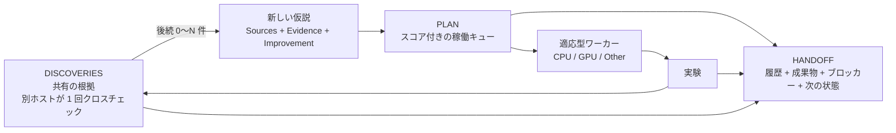
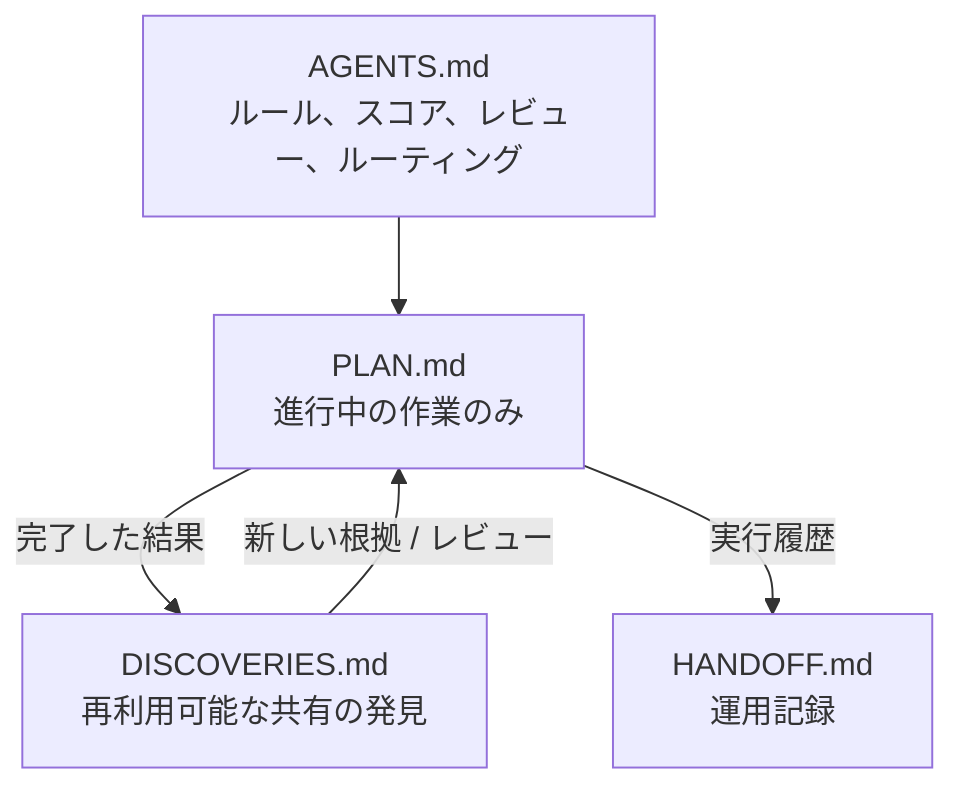
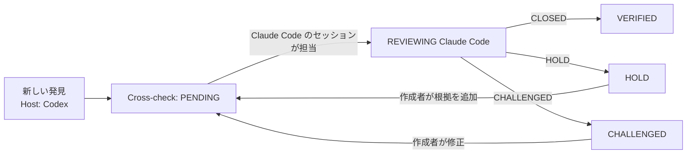

<p align="center">
  
</p>

<p align="center">
  <a href="README.md">English</a> · <a href="README.ko.md">한국어</a> · <a href="README.zh-CN.md">简体中文</a> · <b>日本語</b>
</p>

> このドキュメントは[英語版 README](README.md) の翻訳です。内容に差異がある場合は英語版が優先されます。フィールド名・状態値・コマンドはエージェントがそのまま使う必要があるため、英語のまま残しています。

# Research Orchestrator

1 つまたは複数の AI エージェントセッションのための、軽量で仮説駆動型の研究ワークフローです。

あえて**共有 Markdown ファイル 4 つだけ**を使いながら、スコア付きの仮説キュー、ホスト間での 1 回限りのクロスチェック、適応型ワーカー、CPU/GPU/Other リソースルーティングを提供します。

## なぜ使うのか

- 長期にわたる研究を新しいセッションで再開できます。
- 未完成の計画を共有せずに、複数のエージェントが独立して探索できます。
- 完了した作業を取り除き、`plan.md` を小さく保ちます。
- 同じアイデアを二度キューに入れません。完了した実験は結果にかかわらず（肯定・否定・結論なし）必ず発見として残り、新しい項目はすべて discoveries と他のエージェントのキューと照合されます。
- 実験結果を再利用可能な共有の発見に変えます。
- すべてのセッションが再レビューするのではなく、別のホストが各発見を 1 回だけ確認します。Codex の発見は Claude Code が検証し、その逆も同様です。
- 有望だが未完成の発見は `HOLD` で保持します。
- 明確な根拠と改善点を添えて、発見をより強い仮説として再オープンします。
- 2 つのワーカーから始めて、マシンが実際に耐えられる上限まで拡張します。

## コアワークフロー



1 つの発見から**0 個、1 個、または複数**の新しい仮説が生まれることがあります。1 つの仮説が複数の発見の根拠を組み合わせることもできます。

## 4 つのファイル



| ファイル | 用途 |
| --- | --- |
| `agents.md` | 読み取り、編集、スコアリング、レビュー、リソースルーティングに関する固定ルール。 |
| `plan.md` | **進行中の未完了作業のみ。** 各エージェントが自分のセクションを持ち、スコア付きキューに従って作業します。 |
| `discoveries.md` | **わかっていること**：主張、数値、解釈、検証状態。完了した実験ごとに 1 件残り、各発見は別のホストが 1 回クロスチェックします。 |
| `handoff.md` | **何が起きて、どこから再開するか**：誰が、いつ、どのホストで、成果物のパス、現在のベストなどのプロジェクト全体の値、スロットごとの再開地点。発見の内容は繰り返さず ID で指します。 |

完了した項目は **`plan.md` から外れます**。結果にかかわらず発見 1 件とそれを指す handoff イベントを残し、後続の仮説は新しいスコアで `plan.md` に戻ります。

## テンプレートと実例

各ファイルはテンプレートから作成されます。実例では、進行中のプロジェクトで 4 つのファイルが実際にどう埋まるかを示しています。稼働中のスロット 2 つ（Claude Code の `A`、Codex の `B`）と解放済みのスロット 1 つ（`C`）、`VERIFIED` の発見、レビュー中の発見、後続 0 件を理由付きで記録したネガティブな結果、同じホスト内での引き継ぎ、そしてそれらを生んだ handoff ログが含まれます。

| ファイル | テンプレート | 実例 |
| --- | --- | --- |
| `agents.md` | [AGENTS.md.template](skills/research-orchestrator-skill/templates/AGENTS.md.template) | [agents.md](examples/cv-leakage-study/agents.md) |
| `plan.md` | [PLAN.md.template](skills/research-orchestrator-skill/templates/PLAN.md.template) | [plan.md](examples/cv-leakage-study/plan.md) |
| `discoveries.md` | [DISCOVERIES.md.template](skills/research-orchestrator-skill/templates/DISCOVERIES.md.template) | [discoveries.md](examples/cv-leakage-study/discoveries.md) |
| `handoff.md` | [HANDOFF.md.template](skills/research-orchestrator-skill/templates/HANDOFF.md.template) | [handoff.md](examples/cv-leakage-study/handoff.md) |

---

# インストール

このリポジトリは、同じスキルを **Claude Code、Codex、Google Antigravity** 向けにまとめて提供します。

リポジトリ：

```text
https://github.com/TaeyanG4/research-orchestrator-skill
```

## Claude Code

### プラグインマーケットプレイスからインストール

Claude Code 内で：

```text
/plugin marketplace add TaeyanG4/research-orchestrator-skill
/plugin install research-orchestrator@research-orchestrator
```

初回インストール後は、新しい Claude Code セッションを開始してください。

### プロジェクト専用のスキルインストール

次のフォルダを：

```text
skills/research-orchestrator-skill/
```

以下の場所にクローンまたはコピーします：

```text
<project>/.claude/skills/research-orchestrator-skill/
```

## Codex

### プラグインマーケットプレイスからインストール

ターミナルで：

```bash
codex plugin marketplace add TaeyanG4/research-orchestrator-skill
codex
```

Codex 内で：

```text
/plugins
```

**Research Orchestrator** マーケットプレイスを選択し、`research-orchestrator` をインストールします。初めて使う前に新しいチャットを開始してください。

### スキルを直接インストール

リポジトリスコープ：

```text
<project>/.codex/skills/research-orchestrator-skill/
```

ユーザースコープ：

```text
~/.codex/skills/research-orchestrator-skill/
```

リポジトリの `skills/research-orchestrator-skill/` フォルダを上記いずれかの場所にコピーします。

## Google Antigravity

リポジトリをクローンします：

```bash
git clone https://github.com/TaeyanG4/research-orchestrator-skill.git
```

次に、`skills/research-orchestrator-skill/` を以下のいずれかの場所にコピーします。

プロジェクト/ワークスペーススコープ：

```text
<project>/.agents/skills/research-orchestrator-skill/
```

Antigravity グローバルスコープ：

```text
~/.gemini/config/skills/research-orchestrator-skill/
```

Antigravity CLI の旧/グローバルの場所：

```text
~/.gemini/antigravity-cli/skills/research-orchestrator-skill/
```

Antigravity CLI で `/skills` を使い、認識されたことを確認してください。

---

# クイックスタート

4 つのプロジェクトファイルを初期化します：

```bash
python <installed-skill>/scripts/init_research_orchestrator.py . -n "My Project"
```

複数の独立したエージェントで開始します（`2` → `A, B`）：

```bash
python <installed-skill>/scripts/init_research_orchestrator.py . -n "My Project" --agents 2
```

`--agents` には `A,B,C` のような名前のリストを直接指定することもできます。初期化スクリプトは重複した名前や標準外の名前を拒否し、存在しないファイルだけを作成し、既存のプロジェクトファイルを上書きすることはありません。

その後、セッションの開始時と終了前に毎回 `python <installed-skill>/scripts/check_project.py .` を実行してください（後述の*整合性チェック*を参照）。

## エージェント名

エージェント名は、それを実行するツールやモデルではなく**作業スロット**です。Claude Code、Codex、Antigravity のどのホストも同じ名前を使います：

```text
A, B, C, ... Z, AA, AB, ... ZZ
```

- 単一エージェントの作業では常に `A` を使います。同時に動くセッションが増えるたびに未使用の次の文字を使い、`Z` の後は 2 文字の名前に続きます。解放済みのスロットが先に再利用されるため、新しい文字が生まれるのは既存のスロットがすべて同時に使われているときだけです。
- エージェントに `Claude`、`Codex`、`GPT`、`Gemini` などのホスト名・モデル名を付けないでください。
- どのホストもどのスロットでも引き継げます。スロットをどのホストが担当しているかは、名前ではなく `handoff.md` に記録します：

```markdown
### Agent: A
- Current host: Claude Code
- Current thread: H-A-04
...

### Agent: B
- Current host: Codex
- Current thread: H-B-02
...
```

`Current host` が `unassigned` または `released` なら、そのスロットは空いています。新しいセッションは順番に最初の空きスロットを取り（別のホストが残した plan 項目があるスロットは飛ばし）、`Current host` を自分のホストに設定し、終了時に `released` に戻します。セッションが生きているかどうかは推測せず、ファイルから読み取ります。

完了ログの各イベントにも `Host` が記録されるため、スロットの担当が替わっても、各ステップをどのホストが行ったかが履歴に残ります。

ID には所有エージェントが含まれるため、並行して動くエージェント同士で ID が衝突することはありません：

| 対象 | 形式 | 例 |
| --- | --- | --- |
| Plan 項目 | `H-<Agent>-<NN>` | `H-A-01`, `H-B-07` |
| Discovery | `D-<Agent>-<NNN>` | `D-A-001`, `D-C-014` |

## 後続計画と引き継ぎ

- **発見ごとに後続を計画する。** エージェントは発見（新しい結果、ネガティブな結果、クロスチェックの判定）を記録するたびに、次に何をテストするかを決めます。新しい plan 項目は 0 個、1 個、複数のいずれでもよく、それぞれ重複チェックを通します。その発見の影響を受ける自分の項目は再スコアリングするか削除します。0 個も有効な答えですが、必ず理由を添えて `New plan items: none — <reason>` と記録します。
- **キューが空になったら**、次の順で作業を探します：自分のセクションを読み直す → 別ホストの `PENDING` クロスチェックを担当する → 同じホストのスロットから項目を引き継ぐ → 判断によるホスト間の引き継ぎ（最大 1 件） → 発見から新しい仮説を導く → 記録してスロットを解放する。
- **引き継ぎは原則として同じホスト内で行います。** ホストはモデルではなくプラットフォームを指すため、異なるモデルで動く 2 つの Claude Code セッションは同じホストです。`A` のキューが空で、同じホストの `C` に待機中の項目が残っていれば、`A` は優先度が最も高い項目を自分のセクションに移し、自分の次の ID を付けて（`H-C-02` → `### H-A-04 — … (from H-C-02)`）、移動を記録します。元の担当者の `Current thread` にある項目は引き継ぎません。
- **判断によるホスト間の引き継ぎ。** 別のホストが登録した項目は通常そのホストに残します。例外として、より近い作業がすべて尽き、元のスロットが解放済みで（別のホストで稼働中のセッションからは決して取らない）、項目の `Priority` が 15 以上で新しい仮説より明らかに有望なときに限り、**1 件**だけ引き継げます。理由は 1 行で記録します：`took over H-C-01 from C (cross-host: Codex → Claude Code; reason: …) as H-A-12`。その項目を終えたら、また最初の順番から作業を探します。ユーザーは基準を変えたり、禁止したり、特定の項目を承認したりできます。

<p align="center">
  
</p>

## 読み取りルール

各エージェントは次の順で読みます：

```text
agents.md
→ all discoveries.md
→ shared handoff log + its own active handoff
→ only its own detailed PLAN section
```

エージェントは、作業の調整だけを目的に、他の稼働中エージェントの詳細な PLAN を読むことは**ありません**。他のセクションをのぞく例外は 4 つだけです。ディスパッチャーがタスクのメタデータを読む場合、重複チェックのために項目見出しと `Hypothesis` 行を読む場合、空きスロットや引き継ぎ元を探すために `Current host`・`Current thread` 行を読む場合、そして引き継ぐと決めた項目 1 件を読む場合です。

---

# 標準の PLAN 形式

進行中の未完了項目だけを残します。

```markdown
### H-A-07 — Separate duplicate leakage from group leakage
- Sources: D-B-014, D-A-021
- Hypothesis: exact duplicates explain most apparent group leakage
- Evidence: D-B-014 weakens after deduplication; D-A-021 identifies repeated rows
- Improvement: isolate exact duplicates before constructing candidate groups
- Impact: 3
- Information: 3
- Confidence: 2
- Unblock: 3
- Diversity: 2
- Cost: 1
- Priority: 21
- Resource: CPU
- Parallel: YES
- Other: NONE
- Next test: compare random CV and GroupKFold after exact-duplicate removal
```

### 優先度の計算式

すべての要素を 0〜3 で評価します。

```text
Priority = 2*Impact + 2*Information + Confidence + Unblock + Diversity + (3-Cost)
```

ブロックされている場合や明示的に指定された場合を除き、スコアが最も高い項目から実行します。同点の場合は `Cost` が低いもの、次に `Information` が高いものを優先します。

発見を PLAN に戻すときは、次のフィールドが必須です：

- `Sources` — どの発見から生まれたか。
- `Evidence` — なぜもう一度テストする価値があるのか。
- `Improvement` — 以前の試みと比べて、何が実質的に異なるか、より強いか。

古いアイデアを新しいタスク ID で単に再実行しないでください。

### 項目を追加する前の重複チェック

1. `discoveries.md` を検索します。完了した実験は肯定・否定（`Finding: <claim> does not hold under <conditions>`）・結論なしのいずれもここにあります。`VERIFIED` の主張は実質的な `Improvement` がなければスキップし、`CHALLENGED` の主張は解決するまでスキップします。
2. 他のエージェントの plan セクションを確認しますが、項目見出しと `Hypothesis` 行**だけ**を読みます。すでにキューにあれば追加しません。
3. 書き込む直前に `plan.md` を読み直します。その間に同じ項目が現れていたら、先にあったものを残します。

---

# 標準の DISCOVERIES 形式

```markdown
## D-B-014 — Random CV may leak groups
- Source: B
- Host: Codex
- Cross-check: HOLD
- Finding: duplicated groups cross random folds
- Evidence: e014_group_check.py; random CV 0.9162 vs group CV 0.9027
- Implication: current validation may be optimistic
- Reviews:
  - Claude Code (A): HOLD — plausible, but exact duplicates must be separated first
```

検証はエージェント単位ではなく**ホスト**単位です。Codex で生まれた発見は Claude Code（または別のホスト）が **1 回**確認し、その逆も同様です。同じホストのセッションは同じ盲点を共有するため、互いに再レビューしません。Claude Code のセッションが 10 個あっても、同じ発見を 10 回レビューすることはありません。

<p align="center">
  
</p>



`Cross-check` の状態：

- `PENDING` — まだ別のホストがレビューしていない。
- `REVIEWING <Host> (<Agent>)` — 別ホストのセッションがレビューを担当中のため、他のセッションは重複してレビューしない。
- `VERIFIED` — 別のホストがレビューし、`CLOSED` を記録した。
- `HOLD` — もっともらしいが、具体的な根拠や改善が先に必要。
- `CHALLENGED` — 重大な矛盾、欠陥、または欠けている前提が見つかった。

ルール：

- 作成者は自分の発見をレビューせず、同じホストのセッション同士も互いにレビューしません。
- 別ホストによるレビューは 1 回で十分です。影響が大きい発見や議論のある発見に限り、追加のレビューを行います。
- `HOLD` と `CHALLENGED` のレビューでは、何があればその発見を受け入れられるかを明記する必要があります。作成者が修正すると、`Cross-check` は `PENDING` に戻ります。
- `VERIFIED` の発見は自由に使えます。未検証の発見を根拠にする場合は plan 項目の `Evidence` に明記し、`CHALLENGED` の発見は解決するまで使いません。
- 使えるホストが 1 つだけの場合は、同じホストの別スロットがクロスチェックでき、その理由を `same host —` で始めます。

---

# 標準の HANDOFF 形式

```markdown
### 2026-10-05 21:10 — A — H-A-07
- Host: Claude Code
- Action: cross-checked D-B-014; removed exact duplicates and rebuilt group candidates
- Result: duplicates explain most of the gap; see D-A-003 and the review on D-B-014
- Artifacts: experiments/e027_dedup_groups.py; outputs/e027.csv
- Discovery updates: D-B-014 (review), D-A-003
- Review verdict: D-B-014 HOLD
- Resource: CPU
- Other executor: none
- New plan items: H-A-08, H-A-09
```

`handoff.md` が見通しにくくなったら、古い完了項目を `docs/` 以下にアーカイブし、ルートの handoff には短い要約とリンクだけを残します。

イベントは何が起きたかを記録し、知識は**指し示すだけ**で繰り返しません。`Result` は発見を指す 1 行、`Artifacts` はパスのみで、次の作業の行はありません。各スロットのアクティブセクションにある `Next action` が唯一の「次の作業」です。

### 何をどこに書くか

| 情報 | 記録場所 | ほかの場所では |
| --- | --- | --- |
| 主張、数値、解釈 | `discoveries.md` | handoff の `Result` が発見 ID を指す |
| 検証状態と理由 | `discoveries.md`（`Cross-check`、`Reviews`） | handoff の `Review verdict` は ID と判定のみ |
| 誰が、いつ、どのホストで、何をしたか | `handoff.md` のイベント | — |
| 作成・変更したファイル | `handoff.md` の `Artifacts` | 発見の `Evidence` は再現に必要なファイルだけを引用 |
| 現在のベストなどプロジェクト全体の値 | `handoff.md` の Shared state（発見を引用） | `plan.md` には決して書かない |
| 次にテストすること | `plan.md` の `Next test` | handoff は plan 項目の ID だけを書く |

### 整合性チェック

セッション開始時、引き継ぎの直後、セッション終了前に、同梱のチェックスクリプトを実行します：

```bash
python <installed-skill>/scripts/check_project.py .
```

ファイル間のずれを報告します。plan や handoff のセクションがないアクティブなエージェント、handoff ではキュー待ちとされているのに `plan.md` にない項目、完了済みまたは引き継ぎ済みなのにキューに残っている項目、`plan.md` に書かれたチャンピオンのようなプロジェクト全体の値、古いまたは根拠のない `Current best`、レビュー記録と合わないクロスチェック状態などです。問題ごとに担当エージェントが示され、自分の問題は自分で直し、他のエージェントの問題は `Open consistency issues` に記録します。

---

# 適応型ワーカーと計算リソースのルーティング

並列化が有効な場合は、**2 つのワーカー**（`A`、`B`）から始めます。独立した価値の高い作業と実際のリソースの余裕が残っている間だけ、ワーカーを増やします。

各 PLAN 項目は次を宣言します：

```text
Resource: CPU | GPU | EITHER
Parallel: YES | NO
Other: NONE | <external executor>
```

例：

```text
Other: Kaggle
```

ルーティングの順序：

1. GPU が空いている → 互換性のある GPU/EITHER 項目のうち、優先度が最も高いもの。
2. CPU が空いている → 互換性のある CPU/EITHER 項目のうち、優先度が最も高いもの。
3. ローカルリソースの一方が使用中で、もう一方が空いている → 空いている方を価値のある独立した作業で埋める。
4. ローカルリソースが両方とも飽和している → 利用可能かつ承認済みであれば、対象の作業を `Other` にあふれさせてよい。
5. ハードウェアを遊ばせないためだけに、価値の低い作業を実行しない。
6. メモリ逼迫、I/O 競合、重複作業、スループット低下が見えたらワーカーを減らす。

ワーカー数は目標ではありません。**有用なスループットこそが目標です。**

---

# リポジトリ構成

```text
research-orchestrator-skill/
├── README.md
├── README.ko.md
├── README.zh-CN.md
├── README.ja.md
├── LICENSE
├── .gitignore
├── plugin.json
├── .agents/plugins/marketplace.json
├── .claude-plugin/
│   ├── plugin.json
│   └── marketplace.json
├── .codex-plugin/plugin.json
├── assets/readme/
│   ├── hero.svg
│   ├── cross-host-check.svg
│   └── take-over.svg
├── examples/cv-leakage-study/
│   ├── agents.md
│   ├── plan.md
│   ├── discoveries.md
│   └── handoff.md
├── scripts/validate_release.py
└── skills/
    └── research-orchestrator-skill/
        ├── SKILL.md
        ├── agents/openai.yaml
        ├── scripts/
        │   ├── init_research_orchestrator.py
        │   └── check_project.py
        ├── templates/
        │   ├── AGENTS.md.template
        │   ├── PLAN.md.template
        │   ├── DISCOVERIES.md.template
        │   └── HANDOFF.md.template
        └── assets/icon.svg
```

# 設計原則

- **最小限の共有状態** — 調整用ドキュメントは 4 つだけで、エージェントごとのフォルダ階層はない。
- **独立した探索** — 未完成のエージェントの計画は分離されたまま。
- **共有の根拠** — 完了した発見は discoveries を通じて流れる。
- **ホスト間の検証** — すべてのセッションではなく、別のホストが各発見を 1 回確認する。
- **稼働キューのみ** — 完了した作業は PLAN に蓄積しない。
- **根拠に基づく再試行** — 再び取り上げる発見には根拠と改善点を明記する。
- **適応型の並行性** — ワーカー数は有用な作業と計算リソースの余裕に従う。
- **ホストに依存しないエージェント** — `A`、`B`、`C`、... はどのホストでも引き継げるスロットであり、ホストは handoff に記録する。
- **安全な共有編集** — 共有ファイルは修正の直前に読み直す。

# 検証

変更を公開する前に、組み込みの整合性チェックを実行してください：

```bash
python scripts/validate_release.py
```

リリースは次のチェックをすべて通過する必要があります：

- プラグインとマーケットプレイスのマニフェストが有効な JSON で、バージョンがそろっている。
- 旧スキル名が残っていない。
- スキルの frontmatter に `name` と `description` だけがある。
- README（翻訳版を含む）、SKILL.md、テンプレート、実例の PLAN・DISCOVERIES・HANDOFF が正確なフィールド順に従っている。
- 発見に `Host` と有効な `Cross-check` 状態が記録され、レビューは `<Host> (<Agent>)` 形式で `CLOSED`、`HOLD`、`CHALLENGED` のいずれかを使い、作成者と同じホストから来ていない（`same host —` の表示がある場合を除く）。
- Resource の値は PLAN では `CPU`/`GPU`/`EITHER`、HANDOFF では `CPU`/`GPU`/`Other`/`none`。
- 実際の handoff イベントは発見の更新と新しい plan 項目を列挙するか `none — <reason>` と理由を書き、具体的な `Priority` の値は計算式と一致する。
- 実例と新しく初期化したプロジェクトが `check_project.py` を通過する。
- エージェント名は `A`-`Z`、`AA`-`ZZ` で、ID は `H-<Agent>-NN` と `D-<Agent>-NNN` に従う。
- すべての README に言語切り替えリンクがあり、相対リンクが実在し、画像とコードブロックの構成が同じである。
- 初期化スクリプトは LF でファイルを書き出し、重複または標準外のエージェント名を拒否し、既存のプロジェクトファイルを上書きしない。

# ライセンス

MIT。

## ホストのドキュメント

- Claude Code プラグイン：https://docs.claude.com/en/docs/claude-code/plugins
- OpenAI プラグインのパッケージングとマーケットプレイス：https://developers.openai.com/plugins/build/plugins
- Codex スキル：https://developers.openai.com/blog/eval-skills
- Google Antigravity スキル：https://codelabs.developers.google.com/getting-started-with-antigravity-skills
