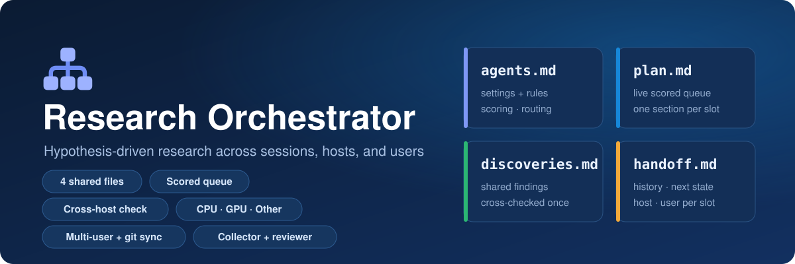
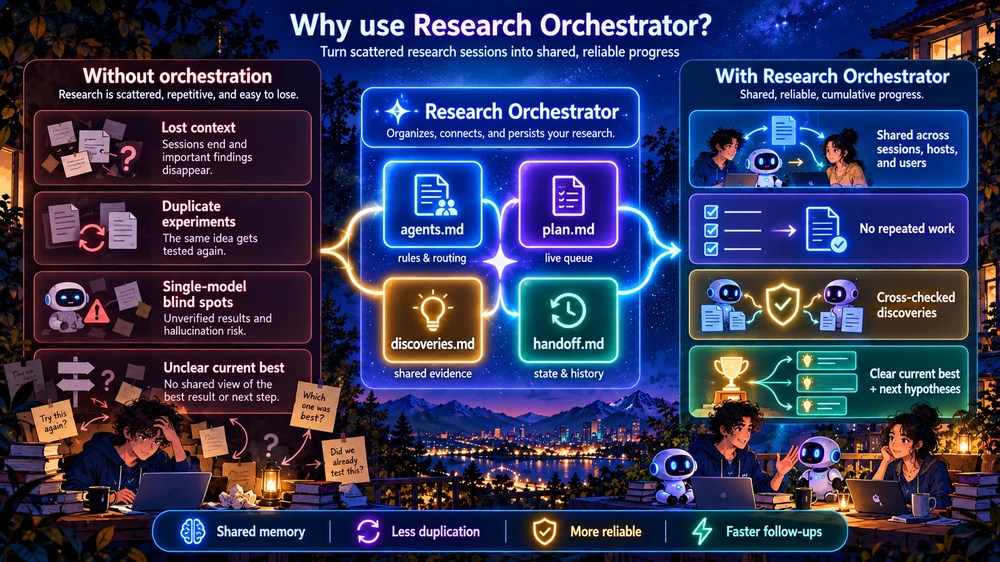
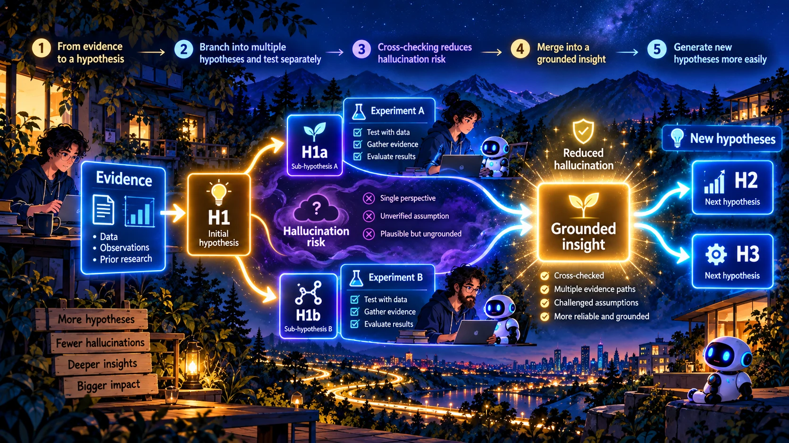
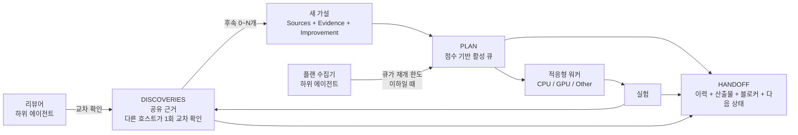
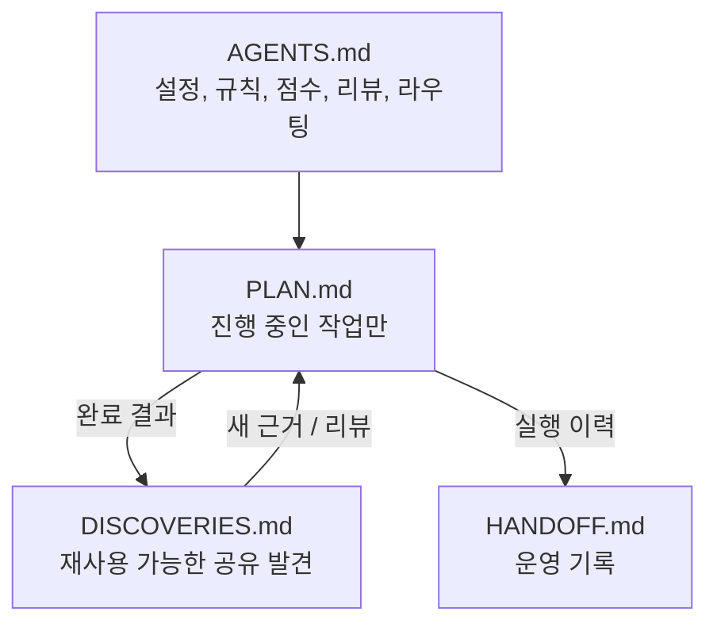
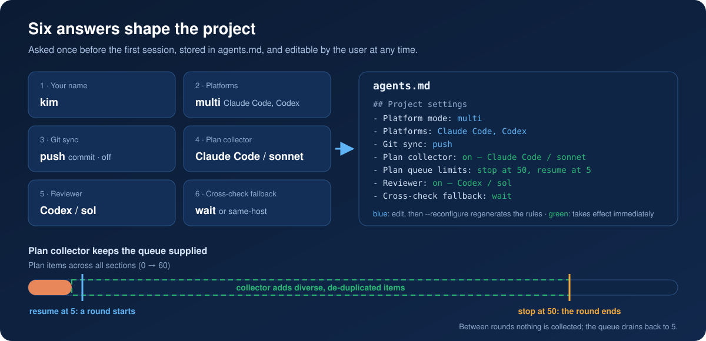
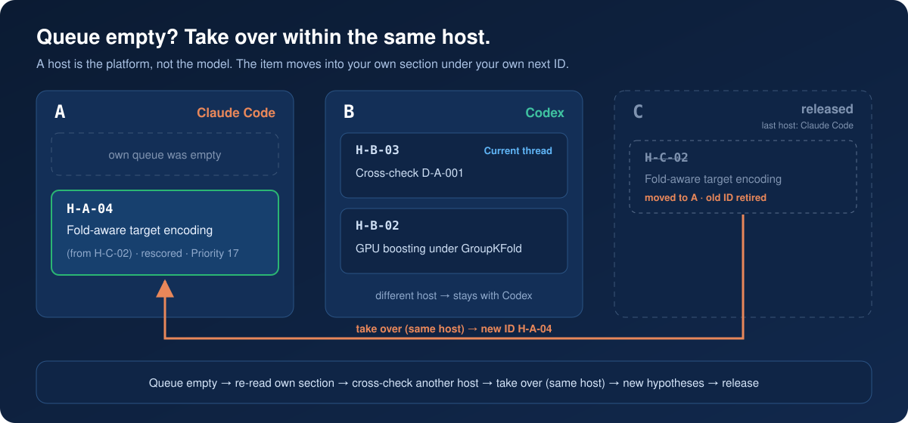
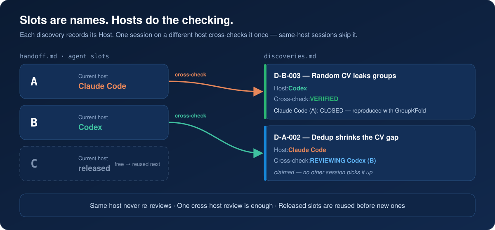
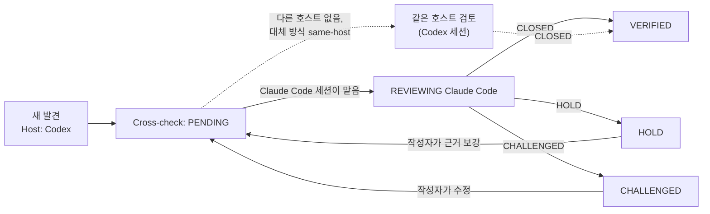

<p align="center">
  
</p>

<p align="center">
  <a href="README.md">English</a> · <b>한국어</b> · <a href="README.zh-CN.md">简体中文</a> · <a href="README.ja.md">日本語</a>
</p>

> 이 문서는 [영어 README](README.md)의 번역본이며, 내용이 다를 경우 영어 원문이 기준입니다. 필드명·상태값·명령어는 에이전트가 그대로 사용해야 하므로 영어로 둡니다.

# Research Orchestrator

하나 또는 여러 AI 에이전트 세션을 위한 가볍고 가설 중심적인 연구 워크플로입니다.

**공유 Markdown 파일 네 개만** 사용하면서도 점수 기반 가설 큐, 호스트 간 1회 교차 확인, 적응형 워커, CPU/GPU/Other 리소스 라우팅을 제공합니다.

## 왜 사용하나요?

AI 에이전트로 하는 연구는 대개 같은 곳에서 무너집니다. 세션이 끝나면 맥락이 사라지고, 두 세션이 같은 실험을 반복하고, 모델 하나가 그렇다고 했다는 이유로 결론을 믿고, 지금 최고 결과가 무엇인지 아무도 정확히 모릅니다. Research Orchestrator는 Markdown 파일 네 개와 적은 수의 규칙으로 이 문제를 풀어서, 어떤 세션·플랫폼·사람이 오가도 연구가 끊기지 않게 합니다.

<p align="center">
  
</p>

**사람과 에이전트의 협업**

- 사람과 AI 에이전트가 같은 파일로 한 프로젝트를 진행합니다. Claude Code의 `kim`, Codex의 `lee`, 읽고 설정만 고치는 세 번째 사람이 모두 같은 상태를 봅니다.
- 에이전트 슬롯(`A`, `B`, ...)은 플랫폼·모델·사람 어디에도 속하지 않습니다. 어떤 호스트나 사용자든 어떤 슬롯이든 이어받을 수 있고, 누가 무엇을 했는지는 추측이 아니라 기록으로 남습니다.
- 각 발견은 다른 플랫폼이 한 번 확인합니다. Codex의 발견은 Claude Code가, 그 반대도 마찬가지입니다. 그래서 결론이 한 모델의 사각지대에 기대지 않습니다. 이 일은 리뷰어 하위 에이전트에게 맡길 수도 있습니다.
- git 동기화로 여러 컴퓨터가 같은 파일을 공유하고, 컴퓨트 점유 표시로 두 세션이 같은 GPU에 동시에 작업을 띄우는 일을 막습니다.

**지속 가능한 자동화 연구**

- 루프가 멈추지 않습니다. 큐가 줄면 수집기 하위 에이전트가 다양하고 중복 없는 가설로 채우고, 에이전트는 빈 컴퓨트에 맞는 실험을 돌리며, 모든 결과(성공·실패·결론 없음)가 발견으로 남아 다음 실험을 정합니다.
- 반복도 유실도 없습니다. 완료된 실험마다 정확히 하나의 발견이 남고, 새 항목은 모두 그것과 대조되며, 현재 최고 결과는 항상 근거 발견을 인용합니다.
- 할 일이 없는 에이전트는 정해진 순서(교차 확인, 넘겨받기, 수집)로 일을 찾고, 막힌 에이전트는 기다리는 동안 다른 일을 합니다. 바쁘게 보이려고 가치 없는 일을 만들지 않습니다.

**커스터마이징과 엔지니어링**

- `agents.md`에서 루프를 조정합니다. 플랫폼, git 동기화, 수집기·리뷰어 모델, 적재 한도, 교차 확인 대체 방식이 모두 사용자가 언제든 고칠 수 있는 설정 줄입니다.
- 에이전틱 엔지니어링: 규칙은 사람이 감독하기 위해서가 아니라 에이전트가 혼자서 따르도록 쓰여 있습니다. 무엇을 읽고, 무엇을 건드리고, 언제 물어볼지가 정해져 있습니다.
- 루프 엔지니어링: 수집 → 실행 → 검증 → 학습 주기와 그 한도, 멈춤 조건이 명시적이고 조정 가능합니다.
- 하네스 엔지니어링: `check_project.py`가 세션이 새 작업을 시작하기 전에 네 파일이 서로 맞는지 확인하고, `validate_release.py`가 스킬 자체의 일관성을 지킵니다. 둘 다 조용히 쌓였을 어긋남을 잡아냅니다.

## 왜 여러 플랫폼인가

언어 모델의 행동에서 나오는 설계 선택 두 가지가 있고, 이것이 이 스킬이 한 플랫폼 안이 아니라 여러 플랫폼에 걸쳐 돌아가는 이유입니다.

- **모든 발견을 다른 플랫폼이 한 번 확인합니다.** 모델은 대화 상대에게 동조하는 경향이 있습니다. 사용자의 관점이든, 확인해 달라고 받은 주장이든 그쪽으로 끌려가고, 같은 대화를 이어가는 세션은 그 끌림을 물려받습니다. 다른 플랫폼의 세션은 발견을 만든 세션의 대화도 사각지대도 공유하지 않으므로, 그 검토는 메아리가 아니라 진짜 두 번째 의견입니다. 검증을 호스트 단위로 하는 이유, 같은 호스트의 검토는 그렇다고 표시해야 하는 이유, 한 플랫폼의 세션 열 개가 서로 다시 검토할 필요가 없는 이유가 여기에 있습니다.
- **코드만이 아니라 가설의 릴레이입니다.** Codex의 가설 H1이 발견이 되고 Claude Code가 그것을 이어받으면, Claude의 가설 H2가 그 위에 쌓입니다. (H1, H2)라는 쌍은 어느 플랫폼도 혼자서는 만들지 못했을 추론의 줄기이고, 거기서 어느 쪽도 혼자서는 제안하지 못했을 가설이 나옵니다. 반대 방향도 마찬가지입니다. 그래서 모든 발견은 후속 가설을 0개 이상 요구하고, 각 가설은 결합한 발견들을 인용하며, 넘겨받은 항목은 제목에 그 연결을 남깁니다.

공유 노트는 썩기 쉽습니다. 비대해지고, 이미 사라진 상태를 기준으로 결론을 내리며, 실수로 넓은 영역을 닫아 버립니다. 여기서는 `plan.md`에 진행 중인 항목만 두고, 모든 사실은 한 곳에만 적히고, 현재 최고 결과는 항상 근거 발견을 인용하며, 실패한 아이디어는 영구히 금지되는 대신 실질적인 `Improvement`를 제시하면 다시 열리고, 네 파일이 어긋나는 순간 점검기가 알려 줍니다.

<p align="center">
  
</p>

## 핵심 워크플로



하나의 발견에서 **0개, 1개 또는 여러 개**의 새 가설이 나올 수 있습니다. 하나의 가설이 여러 발견의 근거를 결합할 수도 있습니다.

## 네 개의 파일



| 파일 | 용도 |
| --- | --- |
| `agents.md` | 읽기, 편집, 점수, 리뷰, 리소스 라우팅에 관한 고정 규칙. |
| `plan.md` | **진행 중인 미완료 작업만.** 각 에이전트가 자기 섹션을 가지고 점수 큐에 따라 작업합니다. |
| `discoveries.md` | **알고 있는 것**: 주장, 수치, 해석, 검증 상태. 완료된 실험마다 하나씩 남고, 각 발견은 다른 호스트가 한 번 교차 확인합니다. |
| `handoff.md` | **무슨 일이 있었고 어디서 재개하는지**: 누가, 언제, 어느 호스트에서, 산출물 경로, 현재 최고 결과 같은 프로젝트 공통 값, 슬롯별 재개 지점. 발견 내용은 반복하지 않고 ID로 가리킵니다. |

완료된 항목은 **`plan.md`에서 빠집니다**. 결과가 무엇이든 discovery 하나와 그것을 가리키는 handoff 이벤트를 남기고, 후속 가설은 점수를 새로 매겨 `plan.md`로 돌아갑니다.

## 템플릿과 실제 예시

각 파일은 템플릿에서 만들어집니다. 실제 예시는 진행 중인 프로젝트에서 네 파일이 어떻게 채워지는지 보여 줍니다. 활성 슬롯 두 개(Claude Code의 `A`, Codex의 `B`)와 해제된 슬롯 하나(`C`), `VERIFIED`된 발견, 검토 중인 발견, 후속 0개를 이유와 함께 기록한 부정 결과, 같은 호스트 간 작업 넘겨받기, 그리고 이들을 만든 handoff 로그가 들어 있습니다.

| 파일 | 템플릿 | 실제 예시 |
| --- | --- | --- |
| `agents.md` | [AGENTS.md.template](skills/research-orchestrator-skill/templates/AGENTS.md.template) | [agents.md](examples/cv-leakage-study/agents.md) |
| `plan.md` | [PLAN.md.template](skills/research-orchestrator-skill/templates/PLAN.md.template) | [plan.md](examples/cv-leakage-study/plan.md) |
| `discoveries.md` | [DISCOVERIES.md.template](skills/research-orchestrator-skill/templates/DISCOVERIES.md.template) | [discoveries.md](examples/cv-leakage-study/discoveries.md) |
| `handoff.md` | [HANDOFF.md.template](skills/research-orchestrator-skill/templates/HANDOFF.md.template) | [handoff.md](examples/cv-leakage-study/handoff.md) |

---

# 설치

이 저장소는 같은 스킬을 **Claude Code, Codex, Google Antigravity**용으로 함께 제공합니다.

저장소:

```text
https://github.com/TaeyanG4/research-orchestrator-skill
```

## Claude Code

### 플러그인 마켓플레이스로 설치

Claude Code 안에서:

```text
/plugin marketplace add TaeyanG4/research-orchestrator-skill
/plugin install research-orchestrator@research-orchestrator
```

처음 설치한 뒤에는 새 Claude Code 세션을 시작하세요.

### 프로젝트 전용 스킬 설치

다음 폴더를:

```text
skills/research-orchestrator-skill/
```

아래 위치로 복제하거나 복사합니다:

```text
<project>/.claude/skills/research-orchestrator-skill/
```

## Codex

### 플러그인 마켓플레이스로 설치

터미널에서:

```bash
codex plugin marketplace add TaeyanG4/research-orchestrator-skill
codex
```

Codex 안에서:

```text
/plugins
```

**Research Orchestrator** 마켓플레이스를 선택하고 `research-orchestrator`를 설치합니다. 처음 사용하기 전에 새 채팅을 시작하세요.

### 스킬 직접 설치

저장소 범위:

```text
<project>/.codex/skills/research-orchestrator-skill/
```

사용자 범위:

```text
~/.codex/skills/research-orchestrator-skill/
```

저장소의 `skills/research-orchestrator-skill/` 폴더를 위 위치 중 하나에 복사합니다.

## Google Antigravity

저장소를 복제합니다:

```bash
git clone https://github.com/TaeyanG4/research-orchestrator-skill.git
```

그다음 `skills/research-orchestrator-skill/`을 아래 위치 중 하나에 복사합니다.

프로젝트/워크스페이스 범위:

```text
<project>/.agents/skills/research-orchestrator-skill/
```

Antigravity 전역 범위:

```text
~/.gemini/config/skills/research-orchestrator-skill/
```

Antigravity CLI 이전/전역 위치:

```text
~/.gemini/antigravity-cli/skills/research-orchestrator-skill/
```

Antigravity CLI에서 `/skills`로 인식되었는지 확인하세요.

---

# 빠른 시작

처음 사용할 때 에이전트가 세 가지(이름, 플랫폼, git 동기화)를 묻고(아래 *설정 질문* 참고) 프로젝트를 초기화합니다. 초기화 스크립트를 직접 실행할 수도 있습니다. 한 사람이 한 플랫폼에서 git 없이:

```bash
python <installed-skill>/scripts/init_research_orchestrator.py . -n "My Project" --user kim --platform single --platforms "Claude Code" --git off
```

두 플랫폼에서 동시에 에이전트 두 개(`2` → `A, B`)로, git으로 공유하며:

```bash
python <installed-skill>/scripts/init_research_orchestrator.py . -n "My Project" --agents 2 --user kim --platform multi --platforms "Claude Code, Codex" --git push --collector "Claude Code/sonnet" --queue-limits 50,5 --reviewer "Codex/sol" --fallback wait
```

`--agents`에는 `A,B,C`처럼 이름 목록을 직접 넣을 수도 있습니다. 초기화 스크립트는 중복되거나 표준이 아닌 이름을 거부하고, 없는 파일만 만들며, 기존 프로젝트 파일은 절대 덮어쓰지 않습니다.

이후 세션을 시작할 때와 끝낼 때마다 `python <installed-skill>/scripts/check_project.py .`을 실행하세요(아래 *일관성 점검* 참고).

## 설정 질문

| 질문 | 선택지 | 바뀌는 것 |
| --- | --- | --- |
| 이름 | 한 단어, 예: `kim`, `user1` | `Users`, `Current user`, 이벤트의 `User`에 기록되어 여러 사람이 한 프로젝트를 함께 쓸 수 있음 |
| 플랫폼 | `multi` — 여러 플랫폼 동시 사용(예: Claude Code와 Codex)<br>`single` — 한 플랫폼<br>`adaptive` — 상황에 따라 | `agents.md`가 이에 맞게 생성됨: `single`은 호스트 간 규칙을 빼고 슬롯끼리 교차 확인, `multi`는 호스트끼리 교차 확인, `adaptive`는 다른 호스트를 우선하고 없으면 다른 슬롯으로 |
| Git 동기화 | `push` — 자동 커밋과 푸시<br>`commit` — 로컬 커밋만<br>`off` — git 사용 안 함 | `push`는 수정 전 `git pull --rebase`, 연결된 변경과 세션 종료 때마다 커밋과 푸시. 사람이나 세션이 다른 컴퓨터에서 일하면 필요 프로젝트가 git 저장소가 아니면 보고한 뒤 `off`로 전환하며, 에이전트는 `git init`을 실행하지 않음. |
| 플랜 수집기 | `off` 또는 플랫폼/모델(예: `Claude Code/sonnet`, `Codex/sol`), 그리고 적재 한도(기본 `50,5`) | 하위 에이전트가 다양한 연구 후보를 `plan.md`에 모음. 큐가 재개 한도(5)까지 줄면 수집을 시작하고 중단 한도(50)에 닿으면 멈춤 |
| 리뷰어 | `off` 또는 플랫폼/모델(예: `Codex/sol`) | 끝난 작업의 교차 확인을 리뷰어 하위 에이전트가 맡아 메인 에이전트는 실험을 계속함 |
| 교차 확인 대체 방식 | `wait` 또는 `same-host` | 큐가 비었는데 다른 플랫폼의 확인이 필요한 항목만 남았을 때: 그대로 두거나, 같은 플랫폼 모델로 진행(`same host —`) |

<p align="center">
  
</p>

답은 `agents.md` 맨 위 `## Project settings`에 기록되고, 이후 세션은 다시 묻지 않고 이 설정을 읽으며 사용자 이름만 묻습니다. 이 줄들은 언제든 직접 고칠 수 있습니다. 수집기, 적재 한도, 리뷰어, 대체 방식은 바로 적용되고, 플랫폼 모드·플랫폼·git 동기화를 고친 뒤에는 아래를 실행해 규칙을 다시 생성합니다(`agents.md`만 다시 쓰며, 규칙 본문을 손으로 고쳤다면 `--force` 없이는 덮어쓰지 않습니다):

```bash
python <installed-skill>/scripts/init_research_orchestrator.py . --reconfigure --platform adaptive --git push
```

## 에이전트 이름

모든 세션에는 이름이 세 가지 나옵니다. 서로 섞지 마세요:

| 이름 | 의미 | 예시 |
| --- | --- | --- |
| 에이전트(슬롯) | 작업 자리 | `A`, `B`, `AA` |
| 호스트 | 모델이 아니라 플랫폼 | `Claude Code`, `Codex` |
| 사용자 | 세션을 실행하는 사람 | `kim`, `user1` |

다른 사용자가 실행 중인 슬롯에서는 작업을 넘겨받지 않습니다.


에이전트 이름은 실행하는 도구나 모델이 아니라 **작업 슬롯**입니다. Claude Code, Codex, Antigravity 등 모든 호스트가 같은 이름을 씁니다:

```text
A, B, C, ... Z, AA, AB, ... ZZ
```

- 단일 에이전트 작업은 항상 `A`를 씁니다. 동시에 실행되는 세션이 늘어나면 사용하지 않은 다음 글자를 차례로 쓰고, `Z` 다음은 두 글자 이름으로 이어집니다. 해제된 슬롯을 먼저 재사용하므로, 새 글자는 기존 슬롯이 모두 동시에 사용 중일 때만 생깁니다.
- 에이전트 이름을 `Claude`, `Codex`, `GPT`, `Gemini` 같은 호스트·모델 이름으로 짓지 마세요.
- 어떤 호스트든 어떤 슬롯이든 이어받을 수 있습니다. 슬롯을 어느 호스트가 맡고 있는지는 이름이 아니라 `handoff.md`에 기록합니다:

```markdown
### Agent: A
- Current host: Claude Code
- Current user: kim
- Current thread: H-A-04
...

### Agent: B
- Current host: Codex
- Current user: lee
- Current thread: H-B-02
...
```

`Current host`가 `unassigned` 또는 `released`이면 빈 슬롯입니다. 새 세션은 순서상 첫 번째 빈 슬롯을 잡되 다른 호스트가 남긴 plan 항목이 있는 슬롯은 건너뛰고, `Current host`를 자기 호스트로 바꾼 뒤, 종료할 때 다시 `released`로 돌려놓습니다. 세션이 살아 있는지는 추측하지 않고 파일에서 읽습니다.

완료 로그의 각 이벤트에도 `Host`가 기록되므로, 슬롯의 주인이 바뀌어도 각 단계를 어느 호스트가 했는지 이력에 남습니다.

ID에는 소유 에이전트가 들어가므로 동시에 작업하는 에이전트끼리 ID가 겹치지 않습니다:

| 대상 | 형식 | 예시 |
| --- | --- | --- |
| Plan 항목 | `H-<Agent>-<NN>` | `H-A-01`, `H-B-07` |
| Discovery | `D-<Agent>-<NNN>` | `D-A-001`, `D-C-014` |

## 후속 계획과 작업 넘겨받기

- **발견마다 후속 계획 세우기.** 에이전트는 발견(새 결과, 부정 결과, 교차 확인 판정)을 기록할 때마다 다음에 무엇을 실험할지 정합니다. 새 plan 항목은 0개, 1개, 여러 개 모두 가능하며 각각 중복 확인을 거칩니다. 그 발견으로 영향을 받는 자기 항목은 점수를 다시 매기거나 지웁니다. 0개도 답이 될 수 있지만, 반드시 이유와 함께 `New plan items: none — <reason>`으로 기록합니다.
- **큐가 비었을 때**는 다음 순서로 일을 찾습니다: 자기 섹션 다시 읽기 → 다른 호스트의 `PENDING` 교차 확인 맡기 → 같은 호스트 슬롯의 항목 넘겨받기 → 판단에 따른 호스트 간 넘겨받기(최대 한 개) → 발견에서 새 가설 도출 → 기록 후 슬롯 해제.
- **넘겨받기는 기본적으로 같은 호스트 안에서만 합니다.** 호스트는 모델이 아니라 플랫폼이므로, 모델이 다른 Claude Code 세션 두 개는 같은 호스트입니다. `A`의 큐가 비었고 같은 호스트인 `C`에 대기 항목이 남아 있으면, `A`는 우선순위가 가장 높은 항목을 자기 섹션으로 옮겨 자기 다음 ID를 붙이고(`H-C-02` → `### H-A-04 — … (from H-C-02)`) 이동을 기록합니다. 원래 주인의 `Current thread` 항목이나 `Active compute`에 점유된 항목은 가져가지 않습니다.
- **판단에 따른 호스트 간 넘겨받기.** 다른 호스트가 등록한 항목은 원래 그 호스트에 남겨 둡니다. 예외적으로, 더 가까운 일이 모두 소진되었고, 원래 슬롯이 해제 상태이며(다른 호스트가 작업 중인 슬롯은 절대 안 됨), 항목의 `Priority`가 15 이상이고 새로 세울 수 있는 가설보다 확실히 나을 때 **한 개**만 넘겨받을 수 있습니다. 이유는 한 줄로 기록합니다: `took over H-C-01 from C (cross-host: Codex → Claude Code; reason: …) as H-A-12`. 그 항목을 끝내면 순서를 처음부터 다시 따릅니다. 사용자는 기준을 바꾸거나, 금지하거나, 특정 항목을 승인할 수 있습니다.

<p align="center">
  
</p>

## 읽기 규칙

각 에이전트는 다음 순서로 읽습니다:

```text
agents.md
→ all discoveries.md
→ shared handoff log + its own active handoff
→ only its own detailed PLAN section
```

에이전트는 작업 조율만을 위해 다른 활성 에이전트의 상세 PLAN을 읽지 **않습니다**. 다른 섹션을 들여다보는 예외는 네 가지뿐입니다. 디스패처가 작업 메타데이터를 읽는 경우, 중복 확인을 위해 항목 제목과 `Hypothesis` 줄을 읽는 경우, 빈 슬롯이나 넘겨받을 항목을 찾으려고 `Current host`·`Current thread` 줄을 읽는 경우, 그리고 넘겨받기로 한 항목 하나를 읽는 경우입니다.

---

# 표준 PLAN 형식

진행 중인 미완료 항목만 둡니다.

```markdown
### H-A-07 — Separate duplicate leakage from group leakage
- Sources: D-B-014, D-A-021
- Hypothesis: exact duplicates explain most apparent group leakage
- Evidence: D-B-014 weakens after deduplication; D-A-021 identifies repeated rows
- Improvement: isolate exact duplicates before constructing candidate groups
- Impact: 3
- Information: 3
- Confidence: 2
- Unblock: 3
- Diversity: 2
- Cost: 1
- Priority: 21
- Resource: CPU
- Parallel: YES
- Other: NONE
- Next test: compare random CV and GroupKFold after exact-duplicate removal
```

### 우선순위 공식

모든 요소를 0~3점으로 매깁니다.

```text
Priority = 2*Impact + 2*Information + Confidence + Unblock + Diversity + (3-Cost)
```

막혀 있거나 명시적으로 지정된 경우가 아니면 점수가 가장 높은 항목부터 실행합니다. 동점이면 `Cost`가 낮은 쪽, 그다음 `Information`이 높은 쪽을 먼저 합니다.

발견을 다시 PLAN으로 가져올 때는 다음 필드가 필수입니다:

- `Sources` — 어떤 발견에서 나왔는지.
- `Evidence` — 왜 다시 실험할 가치가 있는지.
- `Improvement` — 이전 시도와 비교해 무엇이 실질적으로 다르거나 더 강한지.

예전 아이디어를 새 작업 ID로 바꿔 그대로 다시 돌리지 마세요.

### 항목 추가 전 중복 확인

1. `discoveries.md`를 검색합니다. 완료된 실험은 성공, 실패(`Finding: <claim> does not hold under <conditions>`), 결론 없음 모두 여기에 있습니다. `VERIFIED`인 주장은 실질적인 `Improvement`가 없으면 건너뛰고, `CHALLENGED`인 주장은 해결될 때까지 건너뜁니다.
2. 다른 에이전트의 plan 섹션을 훑되, 항목 제목과 `Hypothesis` 줄**만** 읽습니다. 이미 큐에 있으면 추가하지 않습니다.
3. 쓰기 직전에 `plan.md`를 다시 읽습니다. 그사이 같은 항목이 생겼다면 먼저 생긴 것을 유지합니다.

---

# 표준 DISCOVERIES 형식

```markdown
## D-B-014 — Random CV may leak groups
- Source: B
- Host: Codex
- Cross-check: HOLD
- Finding: duplicated groups cross random folds
- Evidence: e014_group_check.py; random CV 0.9162 vs group CV 0.9027
- Implication: current validation may be optimistic
- Reviews:
  - Claude Code (A): HOLD — plausible, but exact duplicates must be separated first
```

검증은 에이전트 단위가 아니라 **호스트** 단위입니다. Codex에서 나온 발견은 Claude Code(또는 다른 호스트)가 **한 번** 확인하고, 그 반대도 마찬가지입니다. 같은 호스트의 세션들은 같은 사각지대를 공유하므로 서로 다시 검토하지 않습니다. Claude Code 세션이 열 개여도 같은 발견을 열 번 검토하지 않습니다.

<p align="center">
  
</p>



`Cross-check` 상태:

- `PENDING` — 아직 다른 호스트가 검토하지 않음.
- `REVIEWING <Host> (<Agent>)` — 다른 호스트의 세션이 검토를 맡아서, 다른 세션이 중복으로 검토하지 않음.
- `VERIFIED` — 다른 호스트가 검토하고 `CLOSED`를 기록함.
- `HOLD` — 그럴듯하지만 구체적인 근거나 개선이 먼저 필요함.
- `CHALLENGED` — 중대한 모순, 결함, 빠진 가정이 발견됨.

규칙:

- 작성자는 자기 발견을 검토하지 않고, 같은 호스트의 세션끼리도 서로 검토하지 않습니다.
- 다른 호스트의 검토는 한 번이면 충분합니다. 영향이 크거나 논란이 있는 발견에만 추가 검토를 합니다.
- `HOLD`와 `CHALLENGED` 검토는 무엇이 있으면 발견을 받아들일 수 있는지 밝혀야 합니다. 작성자가 수정하면 `Cross-check`는 `PENDING`으로 돌아갑니다.
- `VERIFIED`인 발견은 자유롭게 사용할 수 있습니다. 검증되지 않은 발견을 근거로 쓸 때는 plan 항목의 `Evidence`에 밝혀야 하고, `CHALLENGED`인 발견은 해결될 때까지 사용하지 않습니다.
- 호스트가 하나뿐이면 같은 호스트의 다른 슬롯이 교차 확인할 수 있으며, 이때 사유를 `same host —`로 시작합니다.

---

# 표준 HANDOFF 형식

```markdown
### 2026-10-05 21:10 — A — H-A-07
- Host: Claude Code
- User: kim
- Action: cross-checked D-B-014; removed exact duplicates and rebuilt group candidates
- Result: duplicates explain most of the gap; see D-A-003 and the review on D-B-014
- Artifacts: experiments/e027_dedup_groups.py; outputs/e027.csv
- Discovery updates: D-B-014 (review), D-A-003
- Review verdict: D-B-014 HOLD
- Resource: CPU
- Other executor: none
- New plan items: H-A-08, H-A-09
```

`handoff.md`가 훑어보기 어려울 만큼 커지면 오래된 완료 항목을 `docs/` 아래로 옮기고, 루트 handoff에는 짧은 요약과 링크만 남깁니다.

이벤트는 무슨 일이 있었는지를 기록하고 지식은 **가리키기만** 하며 반복하지 않습니다. `Result`는 discovery를 가리키는 한 줄, `Artifacts`는 경로만 적고, 다음 할 일 줄은 없습니다. 각 슬롯의 활성 섹션에 있는 `Next action`이 유일한 "다음 할 일"입니다.

### 무엇을 어디에 적나

| 정보 | 기록 위치 | 다른 곳에서는 |
| --- | --- | --- |
| 주장, 수치, 해석 | `discoveries.md` | handoff `Result`가 discovery ID를 가리킴 |
| 검증 상태와 이유 | `discoveries.md` (`Cross-check`, `Reviews`) | handoff `Review verdict`는 ID와 판정만 |
| 누가, 언제, 어느 호스트에서, 무엇을 했나 | `handoff.md` 이벤트 | — |
| 만들거나 바꾼 파일 | `handoff.md` `Artifacts` | discovery `Evidence`는 재현에 필요한 파일만 인용 |
| 현재 최고 결과 등 프로젝트 공통 값 | `handoff.md` Shared state (discovery 인용) | `plan.md`에는 절대 두지 않음 |
| 다음에 실험할 것 | `plan.md` `Next test` | handoff는 plan 항목 ID만 적음 |

### 일관성 점검

세션 시작, 작업 넘겨받기 직후, 세션 종료 전에 내장 점검 스크립트를 실행합니다:

```bash
python <installed-skill>/scripts/check_project.py .
```

파일 사이의 어긋남을 보고합니다. plan·handoff 섹션이 없는 활성 에이전트, handoff는 대기 중이라는데 `plan.md`에 없는 항목, 끝났거나 넘겨준 항목이 큐에 남은 경우, `plan.md`에 적힌 챔피언 같은 공통 값, 낡았거나 근거가 없는 `Current best`, 검토 기록과 맞지 않는 교차 확인 상태 등입니다. 문제마다 담당 에이전트가 표시되며, 자기 문제는 직접 고치고 다른 에이전트의 문제는 `Open consistency issues`에 적습니다.

---

# 적응형 워커와 컴퓨트 라우팅

병렬 처리가 유용할 때는 **워커 두 개**(`A`, `B`)로 시작합니다. 독립적이고 가치 있는 작업과 실제 리소스 여유가 남아 있을 때만 워커를 늘립니다.

각 PLAN 항목은 다음을 선언합니다:

```text
Resource: CPU | GPU | EITHER
Parallel: YES | NO
Other: NONE | <external executor>
```

예시:

```text
Other: Kaggle
```

라우팅 순서:

1. GPU가 놀고 있으면 → 호환되는 GPU/EITHER 항목 중 우선순위가 가장 높은 것.
2. CPU가 놀고 있으면 → 호환되는 CPU/EITHER 항목 중 우선순위가 가장 높은 것.
3. 로컬 리소스 하나는 바쁘고 다른 하나가 놀고 있으면 → 놀고 있는 쪽을 가치 있는 독립 작업으로 채움.
4. 로컬 리소스가 둘 다 포화 상태이면 → 사용 가능하고 승인된 경우 해당 작업을 `Other`로 넘길 수 있음.
5. 하드웨어를 놀리지 않으려고 가치 낮은 작업을 돌리지 않음.
6. RAM 부족, I/O 경합, 중복 작업, 처리량 감소가 보이면 워커를 줄임.

워커 수는 목표가 아닙니다. **유용한 처리량이 목표입니다.**

### 컴퓨트 점유와 대기

- **실행 전에 점유 표시.** handoff Shared state의 `Active compute`에 누가 어떤 리소스를 쓰는지 적습니다: `GPU — A (H-A-04, since 2026-10-05 18:20)`. 무거운 작업 전에 점유 기록과 실제 사용량(`nvidia-smi`, 작업 관리자)을 둘 다 확인하고, 점유 표시와 실행을 한 단계로 하며, 작업 종료를 기록하는 단계에서 지웁니다. 두 세션이 동시에 "GPU가 비었다"고 보는 경우를 막는 것이 이 점유 표시입니다.
- **리소스가 바쁘면 기다리되 일은 계속.** 항목이 `Parallel: YES`이고 실측한 여유 메모리와 부하가 확실히 충분할 때가 아니면 같이 띄우지 않습니다. 기다리는 동안: 비어 있는 리소스에 맞는 항목 실행(또는 허용된 `Other` 실행기) → 무거운 컴퓨트가 필요 없는 일(교차 확인, 대기 중인 실험 준비와 작은 샘플 테스트, 결과 분석과 후속 계획, 재채점) → 그래도 할 일이 없을 때만 `Blocker: waiting for GPU (held by A …)`를 남기고 실행 중인 작업 길이에 맞춰 다시 확인합니다.
- **낡은 점유.** 해제된 슬롯이 잡고 있거나 이미 `plan.md`에 없는 항목의 점유는 낡은 것이며 점검기가 보고합니다. 자기 작업이 아직 돌고 있으면 슬롯을 해제하지 않습니다.

---

# 저장소 구조

```text
research-orchestrator-skill/
├── README.md
├── README.ko.md
├── README.zh-CN.md
├── README.ja.md
├── LICENSE
├── .gitignore
├── plugin.json
├── .agents/plugins/marketplace.json
├── .claude-plugin/
│   ├── plugin.json
│   └── marketplace.json
├── .codex-plugin/plugin.json
├── assets/readme/
│   ├── hero.svg
│   ├── cross-host-check.svg
│   ├── take-over.svg
│   ├── setup.svg
│   ├── why-use.webp
│   └── hypothesis-relay.webp
├── examples/cv-leakage-study/
│   ├── agents.md
│   ├── plan.md
│   ├── discoveries.md
│   └── handoff.md
├── scripts/validate_release.py
└── skills/
    └── research-orchestrator-skill/
        ├── SKILL.md
        ├── agents/openai.yaml
        ├── scripts/
        │   ├── init_research_orchestrator.py
        │   └── check_project.py
        ├── templates/
        │   ├── AGENTS.md.template
        │   ├── PLAN.md.template
        │   ├── DISCOVERIES.md.template
        │   └── HANDOFF.md.template
        └── assets/icon.svg
```

# 설계 원칙

- **최소한의 공유 상태** — 조율 문서 네 개, 에이전트별 폴더 구조 없음.
- **독립적 탐색** — 미완성 에이전트 계획은 분리된 채로 유지.
- **공유 근거** — 완료된 발견은 discoveries를 통해 흐름.
- **호스트 간 검증** — 모든 세션이 아니라 다른 호스트가 각 발견을 한 번 확인.
- **활성 큐만 유지** — 완료된 작업은 PLAN에 쌓이지 않음.
- **근거 기반 재시도** — 다시 꺼낸 발견에는 근거와 개선점을 명시.
- **적응형 동시성** — 워커 수는 유용한 작업과 컴퓨트 여유에 따름.
- **호스트 독립적 에이전트** — `A`, `B`, `C`, ...는 어떤 호스트든 이어받을 수 있는 슬롯이며, 호스트는 handoff에 기록.
- **안전한 공유 편집** — 공유 파일은 수정 직전에 다시 읽음.

# 검증

변경 사항을 배포하기 전에 내장 일관성 검사를 실행하세요:

```bash
python scripts/validate_release.py
```

릴리스는 다음 검사를 모두 통과해야 합니다:

- 플러그인·마켓플레이스 매니페스트가 올바른 JSON이며 버전이 같음.
- 이전 스킬 이름이 남아 있지 않음.
- 스킬 frontmatter에 `name`과 `description`만 있음.
- README(번역본 포함), SKILL.md, 템플릿, 실제 예시의 PLAN·DISCOVERIES·HANDOFF가 정확한 필드 순서를 따름.
- 발견에 `Host`와 올바른 `Cross-check` 상태가 기록되고, 검토는 `<Host> (<Agent>)` 형식에 `CLOSED`, `HOLD`, `CHALLENGED` 중 하나를 쓰며, 작성자와 같은 호스트에서 오지 않음(`same host —` 표시 제외).
- Resource 값은 PLAN에서 `CPU`/`GPU`/`EITHER`, HANDOFF에서 `CPU`/`GPU`/`Other`/`none`.
- 실제 handoff 기록은 discovery 갱신과 새 plan 항목을 나열하거나 `none — <reason>`으로 이유를 밝히고, 실제 `Priority` 값은 공식과 일치함.
- 실제 예시와 새로 초기화한 프로젝트가 `check_project.py`를 통과함.
- 에이전트 이름은 `A`-`Z`, `AA`-`ZZ`이고, ID는 `H-<Agent>-NN`과 `D-<Agent>-NNN` 형식을 따름.
- 모든 README가 언어 전환 링크를 갖고, 상대 링크가 실제로 존재하며, 같은 이미지와 코드 블록 구조를 유지함.
- 실제 예시의 `agents.md`가 현재 초기화 스크립트가 만드는 내용과 같음.
- 수집기, 리뷰어, 적재 한도, 대체 방식 설정을 검사하고, 직접 고친 설정은 `--reconfigure`로 적용됨.
- 모든 플랫폼 모드(`single`, `multi`, `adaptive`) × git 모드(`push`, `commit`, `off`) 조합이 깨끗한 `agents.md`를 만들고 점검기를 통과하며, `--reconfigure`는 손으로 고친 내용을 덮어쓰지 않음.
- 초기화 스크립트는 LF로 파일을 쓰고, 중복되거나 표준이 아닌 에이전트 이름을 거부하며, 기존 프로젝트 파일을 덮어쓰지 않음.

# 라이선스

MIT.

## 호스트 문서

- Claude Code 플러그인: https://docs.claude.com/en/docs/claude-code/plugins
- OpenAI 플러그인 패키징과 마켓플레이스: https://developers.openai.com/plugins/build/plugins
- Codex 스킬: https://developers.openai.com/blog/eval-skills
- Google Antigravity 스킬: https://codelabs.developers.google.com/getting-started-with-antigravity-skills
