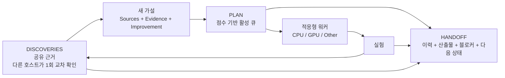
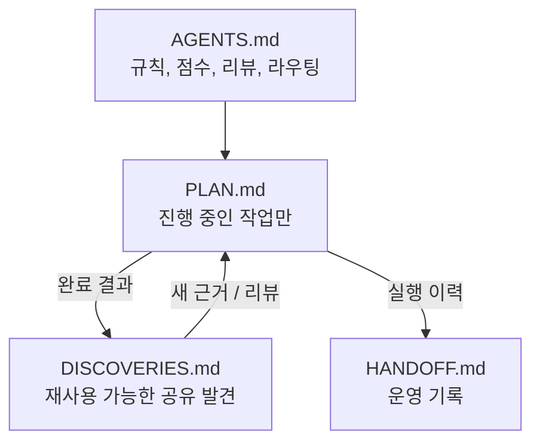
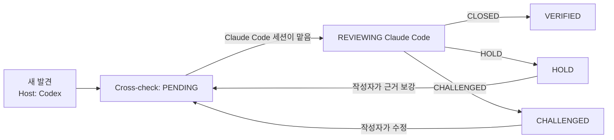

<p align="center">
  
</p>

<p align="center">
  <a href="README.md">English</a> · <b>한국어</b> · <a href="README.zh-CN.md">简体中文</a> · <a href="README.ja.md">日本語</a>
</p>

> 이 문서는 [영어 README](README.md)의 번역본이며, 내용이 다를 경우 영어 원문이 기준입니다. 필드명·상태값·명령어는 에이전트가 그대로 사용해야 하므로 영어로 둡니다.

# Research Orchestrator

하나 또는 여러 AI 에이전트 세션을 위한 가볍고 가설 중심적인 연구 워크플로입니다.

**공유 Markdown 파일 네 개만** 사용하면서도 점수 기반 가설 큐, 호스트 간 1회 교차 검증, 적응형 워커, CPU/GPU/Other 리소스 라우팅을 제공합니다.

## 왜 사용하나요?

- 오래 걸리는 연구를 새 세션에서 이어서 진행합니다.
- 여러 에이전트가 미완성 계획을 공유하지 않고 독립적으로 탐색합니다.
- 완료된 작업을 제거해 `plan.md`를 작게 유지합니다.
- 같은 아이디어를 두 번 등록하지 않습니다. 실패한 가설은 부정 결과로 기록되고, 새 항목은 discoveries, handoff 로그, 다른 에이전트의 큐와 대조합니다.
- 실험 결과를 재사용 가능한 공유 발견으로 바꿉니다.
- 모든 세션이 다시 검토하는 대신, 다른 호스트가 각 발견을 한 번만 확인합니다. Codex의 발견은 Claude Code가, 그 반대도 마찬가지입니다.
- 유망하지만 미완성인 발견은 `HOLD`로 보존합니다.
- 명확한 근거와 개선점을 붙여 발견을 더 강한 가설로 다시 엽니다.
- 워커 2개에서 시작해 머신이 실제로 감당할 수 있는 만큼 확장합니다.

## 핵심 워크플로



하나의 발견에서 **0개, 1개 또는 여러 개**의 새 가설이 나올 수 있습니다. 하나의 가설이 여러 발견의 근거를 결합할 수도 있습니다.

## 네 개의 파일



| 파일 | 용도 |
| --- | --- |
| `agents.md` | 읽기, 편집, 점수, 리뷰, 리소스 라우팅에 관한 고정 규칙. |
| `plan.md` | **진행 중인 미완료 작업만.** 각 에이전트가 자기 섹션을 가지고 점수 큐에 따라 작업합니다. |
| `discoveries.md` | 재사용 가능한 공유 발견. 모든 에이전트가 읽고, 각 발견은 다른 호스트가 한 번 교차 확인합니다. |
| `handoff.md` | 운영 이력, 재개 지점, 산출물, 지표, 블로커, 다음 행동. |

완료된 항목은 **`plan.md`에서 빠집니다**. 실행 이력은 `handoff.md`로, 재사용할 지식은 `discoveries.md`로 가고, 후속 가설은 점수를 새로 매겨 `plan.md`로 돌아갑니다.

## 템플릿과 실제 예시

각 파일은 템플릿에서 만들어집니다. 실제 예시는 진행 중인 프로젝트에서 네 파일이 어떻게 채워지는지 보여 줍니다. 활성 슬롯 두 개(Claude Code의 `Main`, Codex의 `A`)와 해제된 슬롯 하나(`B`), `VERIFIED`된 발견, 검토 중인 발견, 부정 결과, 그리고 이들을 만든 handoff 로그가 들어 있습니다.

| 파일 | 템플릿 | 실제 예시 |
| --- | --- | --- |
| `agents.md` | [AGENTS.md.template](skills/research-orchestrator-skill/templates/AGENTS.md.template) | [agents.md](examples/cv-leakage-study/agents.md) |
| `plan.md` | [PLAN.md.template](skills/research-orchestrator-skill/templates/PLAN.md.template) | [plan.md](examples/cv-leakage-study/plan.md) |
| `discoveries.md` | [DISCOVERIES.md.template](skills/research-orchestrator-skill/templates/DISCOVERIES.md.template) | [discoveries.md](examples/cv-leakage-study/discoveries.md) |
| `handoff.md` | [HANDOFF.md.template](skills/research-orchestrator-skill/templates/HANDOFF.md.template) | [handoff.md](examples/cv-leakage-study/handoff.md) |

---

# 설치

이 저장소는 같은 스킬을 **Claude Code, Codex, Google Antigravity**용으로 함께 제공합니다.

저장소:

```text
https://github.com/TaeyanG4/research-orchestrator-skill
```

## Claude Code

### 플러그인 마켓플레이스로 설치

Claude Code 안에서:

```text
/plugin marketplace add TaeyanG4/research-orchestrator-skill
/plugin install research-orchestrator@research-orchestrator
```

처음 설치한 뒤에는 새 Claude Code 세션을 시작하세요.

### 프로젝트 전용 스킬 설치

다음 폴더를:

```text
skills/research-orchestrator-skill/
```

아래 위치로 복제하거나 복사합니다:

```text
<project>/.claude/skills/research-orchestrator-skill/
```

## Codex

### 플러그인 마켓플레이스로 설치

터미널에서:

```bash
codex plugin marketplace add TaeyanG4/research-orchestrator-skill
codex
```

Codex 안에서:

```text
/plugins
```

**Research Orchestrator** 마켓플레이스를 선택하고 `research-orchestrator`를 설치합니다. 처음 사용하기 전에 새 채팅을 시작하세요.

### 스킬 직접 설치

저장소 범위:

```text
<project>/.codex/skills/research-orchestrator-skill/
```

사용자 범위:

```text
~/.codex/skills/research-orchestrator-skill/
```

저장소의 `skills/research-orchestrator-skill/` 폴더를 위 위치 중 하나에 복사합니다.

## Google Antigravity

저장소를 복제합니다:

```bash
git clone https://github.com/TaeyanG4/research-orchestrator-skill.git
```

그다음 `skills/research-orchestrator-skill/`을 아래 위치 중 하나에 복사합니다.

프로젝트/워크스페이스 범위:

```text
<project>/.agents/skills/research-orchestrator-skill/
```

Antigravity 전역 범위:

```text
~/.gemini/config/skills/research-orchestrator-skill/
```

Antigravity CLI 이전/전역 위치:

```text
~/.gemini/antigravity-cli/skills/research-orchestrator-skill/
```

Antigravity CLI에서 `/skills`로 인식되었는지 확인하세요.

---

# 빠른 시작

프로젝트 파일 네 개를 초기화합니다:

```bash
python <installed-skill>/scripts/init_research_orchestrator.py . -n "My Project"
```

여러 독립 에이전트로 시작합니다 (`2` → `Main, A`):

```bash
python <installed-skill>/scripts/init_research_orchestrator.py . -n "My Project" --agents 2
```

`--agents`에는 `Main,A,B`처럼 이름 목록을 직접 넣을 수도 있습니다. 초기화 스크립트는 중복되거나 표준이 아닌 이름을 거부하고, 없는 파일만 만들며, 기존 프로젝트 파일은 절대 덮어쓰지 않습니다.

## 에이전트 이름

에이전트 이름은 실행하는 도구나 모델이 아니라 **작업 슬롯**입니다. Claude Code, Codex, Antigravity 등 모든 호스트가 같은 이름을 씁니다:

```text
Main, A, B, C, ... Z, AA, AB, ... ZZ
```

- 단일 에이전트 작업은 항상 `Main`을 씁니다. 동시에 실행되는 세션이 늘어나면 사용하지 않은 다음 글자를 차례로 쓰고, `Z` 다음은 두 글자 이름으로 이어집니다. 해제된 슬롯을 먼저 재사용하므로, 새 글자는 기존 슬롯이 모두 동시에 사용 중일 때만 생깁니다.
- 에이전트 이름을 `Claude`, `Codex`, `GPT`, `Gemini` 같은 호스트·모델 이름으로 짓지 마세요.
- 어떤 호스트든 어떤 슬롯이든 이어받을 수 있습니다. 슬롯을 어느 호스트가 맡고 있는지는 이름이 아니라 `handoff.md`에 기록합니다:

```markdown
### Agent: Main
- Current host: Claude Code
- Current thread: H-Main-04
...

### Agent: A
- Current host: Codex
- Current thread: H-A-02
...
```

`Current host`가 `unassigned` 또는 `released`이면 빈 슬롯입니다. 새 세션은 순서상 첫 번째 빈 슬롯을 잡아 `Current host`를 자기 호스트로 바꾸고, 종료할 때 다시 `released`로 돌려놓습니다. 세션이 살아 있는지는 추측하지 않고 파일에서 읽습니다.

완료 로그의 각 이벤트에도 `Host`가 기록되므로, 슬롯의 주인이 바뀌어도 각 단계를 어느 호스트가 했는지 이력에 남습니다.

ID에는 소유 에이전트가 들어가므로 동시에 작업하는 에이전트끼리 ID가 겹치지 않습니다:

| 대상 | 형식 | 예시 |
| --- | --- | --- |
| Plan 항목 | `H-<Agent>-<NN>` | `H-Main-01`, `H-A-07` |
| Discovery | `D-<Agent>-<NNN>` | `D-Main-001`, `D-B-014` |

## 읽기 규칙

각 에이전트는 다음 순서로 읽습니다:

```text
agents.md
→ all discoveries.md
→ shared handoff log + its own active handoff
→ only its own detailed PLAN section
```

에이전트는 작업 조율만을 위해 다른 활성 에이전트의 상세 PLAN을 읽지 **않습니다**. 다른 섹션을 들여다보는 예외는 세 가지뿐입니다. 디스패처가 작업 메타데이터를 읽는 경우, 중복 확인을 위해 항목 제목과 `Hypothesis` 줄을 읽는 경우, 새 세션이 빈 슬롯을 찾으려고 `Current host` 줄을 읽는 경우입니다.

---

# 표준 PLAN 형식

진행 중인 미완료 항목만 둡니다.

```markdown
### H-Main-07 — Separate duplicate leakage from group leakage
- Sources: D-A-014, D-Main-021
- Hypothesis: exact duplicates explain most apparent group leakage
- Evidence: D-A-014 weakens after deduplication; D-Main-021 identifies repeated rows
- Improvement: isolate exact duplicates before constructing candidate groups
- Impact: 3
- Information: 3
- Confidence: 2
- Unblock: 3
- Diversity: 2
- Cost: 1
- Priority: 21
- Resource: CPU
- Parallel: YES
- Other: NONE
- Next test: compare random CV and GroupKFold after exact-duplicate removal
```

### 우선순위 공식

모든 요소를 0~3점으로 매깁니다.

```text
Priority = 2*Impact + 2*Information + Confidence + Unblock + Diversity + (3-Cost)
```

막혀 있거나 명시적으로 지정된 경우가 아니면 점수가 가장 높은 항목부터 실행합니다. 동점이면 `Cost`가 낮은 쪽, 그다음 `Information`이 높은 쪽을 먼저 합니다.

발견을 다시 PLAN으로 가져올 때는 다음 필드가 필수입니다:

- `Sources` — 어떤 발견에서 나왔는지.
- `Evidence` — 왜 다시 실험할 가치가 있는지.
- `Improvement` — 이전 시도와 비교해 무엇이 실질적으로 다르거나 더 강한지.

예전 아이디어를 새 작업 ID로 바꿔 그대로 다시 돌리지 마세요.

### 항목 추가 전 중복 확인

1. 부정 결과를 포함해 `discoveries.md`를 검색합니다. 실패한 가설은 항상 `Finding: <claim> does not hold under <conditions>` 형식으로 기록되어 있습니다. `VERIFIED`인 주장은 실질적인 `Improvement`가 없으면 건너뛰고, `CHALLENGED`인 주장은 해결될 때까지 건너뜁니다.
2. `handoff.md`의 완료 로그와 `docs/`에서 이전 시도를 찾아 인용합니다.
3. 다른 에이전트의 plan 섹션을 훑되, 항목 제목과 `Hypothesis` 줄**만** 읽습니다. 이미 큐에 있으면 추가하지 않습니다.
4. 쓰기 직전에 `plan.md`를 다시 읽습니다. 그사이 같은 항목이 생겼다면 먼저 생긴 것을 유지합니다.

---

# 표준 DISCOVERIES 형식

```markdown
## D-A-014 — Random CV may leak groups
- Source: A
- Host: Codex
- Cross-check: HOLD
- Finding: duplicated groups cross random folds
- Evidence: e014_group_check.py; random CV 0.9162 vs group CV 0.9027
- Implication: current validation may be optimistic
- Reviews:
  - Claude Code (Main): HOLD — plausible, but exact duplicates must be separated first
```

검증은 에이전트 단위가 아니라 **호스트** 단위입니다. Codex에서 나온 발견은 Claude Code(또는 다른 호스트)가 **한 번** 확인하고, 그 반대도 마찬가지입니다. 같은 호스트의 세션들은 같은 사각지대를 공유하므로 서로 다시 검토하지 않습니다. Claude Code 세션이 열 개여도 같은 발견을 열 번 검토하지 않습니다.

<p align="center">
  
</p>



`Cross-check` 상태:

- `PENDING` — 아직 다른 호스트가 검토하지 않음.
- `REVIEWING <Host> (<Agent>)` — 다른 호스트의 세션이 검토를 맡아서, 다른 세션이 중복으로 검토하지 않음.
- `VERIFIED` — 다른 호스트가 검토하고 `CLOSED`를 기록함.
- `HOLD` — 그럴듯하지만 구체적인 근거나 개선이 먼저 필요함.
- `CHALLENGED` — 중대한 모순, 결함, 빠진 가정이 발견됨.

규칙:

- 작성자는 자기 발견을 검토하지 않고, 같은 호스트의 세션끼리도 서로 검토하지 않습니다.
- 다른 호스트의 검토는 한 번이면 충분합니다. 영향이 크거나 논란이 있는 발견에만 추가 검토를 합니다.
- `HOLD`와 `CHALLENGED` 검토는 무엇이 있으면 발견을 받아들일 수 있는지 밝혀야 합니다. 작성자가 수정하면 `Cross-check`는 `PENDING`으로 돌아갑니다.
- `VERIFIED`인 발견은 자유롭게 사용할 수 있습니다. 검증되지 않은 발견을 근거로 쓸 때는 plan 항목의 `Evidence`에 밝혀야 하고, `CHALLENGED`인 발견은 해결될 때까지 사용하지 않습니다.
- 호스트가 하나뿐이면 같은 호스트의 다른 슬롯이 교차 확인할 수 있으며, 이때 사유를 `same host —`로 시작합니다.

---

# 표준 HANDOFF 형식

```markdown
### 2026-10-05 21:10 — Main — H-Main-07
- Host: Claude Code
- Action: cross-checked D-A-014; removed exact duplicates and rebuilt group candidates
- Result: random/group CV gap shrank from 0.0135 to 0.0041
- Evidence: experiments/e027_dedup_groups.py; outputs/e027.csv
- Discovery updates: D-A-014, D-Main-003
- Review verdict: D-A-014 HOLD
- Files/metrics: CV 0.9071 / 0.9030
- Resource: CPU
- Other executor: none
- New plan items: H-Main-08, H-Main-09
- Next resumable action: test near-duplicate clusters
```

`handoff.md`가 훑어보기 어려울 만큼 커지면 오래된 완료 항목을 `docs/` 아래로 옮기고, 루트 handoff에는 짧은 요약과 링크만 남깁니다.

---

# 적응형 워커와 컴퓨트 라우팅

병렬 처리가 유용할 때는 **워커 두 개**(`Main`, `A`)로 시작합니다. 독립적이고 가치 있는 작업과 실제 리소스 여유가 남아 있을 때만 워커를 늘립니다.

각 PLAN 항목은 다음을 선언합니다:

```text
Resource: CPU | GPU | EITHER
Parallel: YES | NO
Other: NONE | <external executor>
```

예시:

```text
Other: Kaggle
```

라우팅 순서:

1. GPU가 놀고 있으면 → 호환되는 GPU/EITHER 항목 중 우선순위가 가장 높은 것.
2. CPU가 놀고 있으면 → 호환되는 CPU/EITHER 항목 중 우선순위가 가장 높은 것.
3. 로컬 리소스 하나는 바쁘고 다른 하나가 놀고 있으면 → 놀고 있는 쪽을 가치 있는 독립 작업으로 채움.
4. 로컬 리소스가 둘 다 포화 상태이면 → 사용 가능하고 승인된 경우 해당 작업을 `Other`로 넘길 수 있음.
5. 하드웨어를 놀리지 않으려고 가치 낮은 작업을 돌리지 않음.
6. RAM 부족, I/O 경합, 중복 작업, 처리량 감소가 보이면 워커를 줄임.

워커 수는 목표가 아닙니다. **유용한 처리량이 목표입니다.**

---

# 저장소 구조

```text
research-orchestrator-skill/
├── README.md
├── README.ko.md
├── README.zh-CN.md
├── README.ja.md
├── LICENSE
├── .gitignore
├── plugin.json
├── .agents/plugins/marketplace.json
├── .claude-plugin/
│   ├── plugin.json
│   └── marketplace.json
├── .codex-plugin/plugin.json
├── assets/readme/
│   ├── hero.svg
│   └── cross-host-check.svg
├── examples/cv-leakage-study/
│   ├── agents.md
│   ├── plan.md
│   ├── discoveries.md
│   └── handoff.md
├── scripts/validate_release.py
└── skills/
    └── research-orchestrator-skill/
        ├── SKILL.md
        ├── agents/openai.yaml
        ├── scripts/init_research_orchestrator.py
        ├── templates/
        │   ├── AGENTS.md.template
        │   ├── PLAN.md.template
        │   ├── DISCOVERIES.md.template
        │   └── HANDOFF.md.template
        └── assets/icon.svg
```

# 설계 원칙

- **최소한의 공유 상태** — 조율 문서 네 개, 에이전트별 폴더 구조 없음.
- **독립적 탐색** — 미완성 에이전트 계획은 분리된 채로 유지.
- **공유 근거** — 완료된 발견은 discoveries를 통해 흐름.
- **호스트 간 검증** — 모든 세션이 아니라 다른 호스트가 각 발견을 한 번 확인.
- **활성 큐만 유지** — 완료된 작업은 PLAN에 쌓이지 않음.
- **근거 기반 재시도** — 다시 꺼낸 발견에는 근거와 개선점을 명시.
- **적응형 동시성** — 워커 수는 유용한 작업과 컴퓨트 여유에 따름.
- **호스트 독립적 에이전트** — `Main`, `A`, `B`, ...는 어떤 호스트든 이어받을 수 있는 슬롯이며, 호스트는 handoff에 기록.
- **안전한 공유 편집** — 공유 파일은 수정 직전에 다시 읽음.

# 검증

변경 사항을 배포하기 전에 내장 일관성 검사를 실행하세요:

```bash
python scripts/validate_release.py
```

릴리스는 다음 검사를 모두 통과해야 합니다:

- 플러그인·마켓플레이스 매니페스트가 올바른 JSON이며 버전이 같음.
- 이전 스킬 이름이 남아 있지 않음.
- 스킬 frontmatter에 `name`과 `description`만 있음.
- README(번역본 포함), SKILL.md, 템플릿, 실제 예시의 PLAN·DISCOVERIES·HANDOFF가 정확한 필드 순서를 따름.
- 발견에 `Host`와 올바른 `Cross-check` 상태가 기록되고, 검토는 `<Host> (<Agent>)` 형식에 `CLOSED`, `HOLD`, `CHALLENGED` 중 하나를 쓰며, 작성자와 같은 호스트에서 오지 않음(`same host —` 표시 제외).
- Resource 값은 PLAN에서 `CPU`/`GPU`/`EITHER`, HANDOFF에서 `CPU`/`GPU`/`Other`/`none`.
- 에이전트 이름은 `Main`, `A`-`Z`, `AA`-`ZZ`이고, ID는 `H-<Agent>-NN`과 `D-<Agent>-NNN` 형식을 따름.
- 모든 README가 언어 전환 링크를 갖고, 상대 링크가 실제로 존재하며, 같은 이미지와 코드 블록 구조를 유지함.
- 실제 예시의 `agents.md`가 현재 초기화 스크립트가 만드는 내용과 같음.
- 초기화 스크립트는 LF로 파일을 쓰고, 중복되거나 표준이 아닌 에이전트 이름을 거부하며, 기존 프로젝트 파일을 덮어쓰지 않음.

# 라이선스

MIT.

## 호스트 문서

- Claude Code 플러그인: https://docs.claude.com/en/docs/claude-code/plugins
- OpenAI 플러그인 패키징과 마켓플레이스: https://developers.openai.com/plugins/build/plugins
- Codex 스킬: https://developers.openai.com/blog/eval-skills
- Google Antigravity 스킬: https://codelabs.developers.google.com/getting-started-with-antigravity-skills
