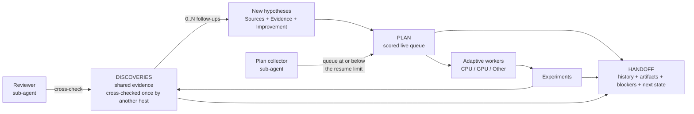
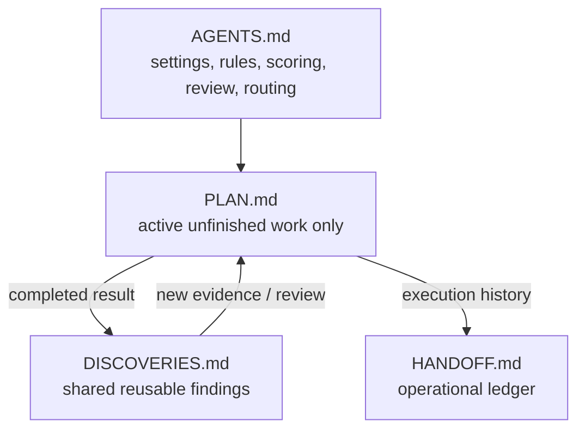
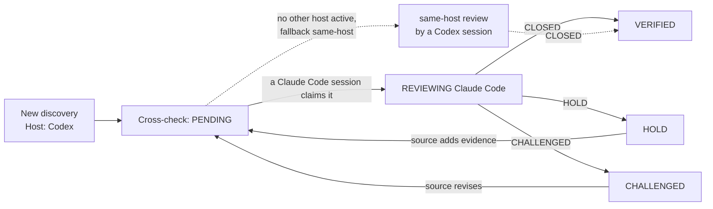

<p align="center">
  
</p>

<p align="center">
  <b>English</b> · <a href="README.ko.md">한국어</a> · <a href="README.zh-CN.md">简体中文</a> · <a href="README.ja.md">日本語</a>
</p>

# Research Orchestrator

A lightweight, hypothesis-driven research workflow for one or many AI agent sessions.

It deliberately uses only **four shared Markdown files** while adding a scored hypothesis queue, one-time cross-host verification, adaptive workers, and CPU/GPU/Other resource routing.

## Why use it?

Research with AI agents usually breaks in the same places: a session ends and its context is gone, two sessions repeat the same experiment, a finding is trusted because one model said so, and nobody can tell what the current best actually is. Research Orchestrator fixes this with four plain Markdown files and a small set of rules, so the work survives any session, any platform, and any person.

**Collaboration between people and agents**

- People and AI agents work on one project through the same files: `kim` on Claude Code, `lee` on Codex, and a third person who only reads and edits settings all see the same state.
- Agent slots (`A`, `B`, ...) belong to no platform, model, or person. Any host or user can resume any slot; who did what is recorded, never guessed.
- A different platform checks each finding once — Codex's discovery is verified by Claude Code, and vice versa — so a result never rests on a single model's blind spots. A reviewer sub-agent can take this over.
- Git sync shares the files across machines; compute claims stop two sessions from launching on the same GPU.

**Sustainable, automated research**

- The loop keeps running: a collector sub-agent refills the queue with diverse, de-duplicated hypotheses when it runs low, agents run what fits the free compute, and every result — positive, negative, or inconclusive — becomes a discovery that plans the next test.
- Nothing is repeated and nothing is lost: every completed experiment leaves exactly one discovery, every new item is checked against them, and the current best always cites the discovery that set it.
- An idle agent looks for work in a fixed order (cross-checks, take-over, collection) and a blocked one waits productively; it never invents low-value work to stay busy.

**Customization and engineering**

- Customize the loop in `agents.md`: platforms, git sync, collector and reviewer models, queue limits, and the cross-check fallback are plain settings lines that the user can edit at any time.
- Agentic engineering: the rules are written for agents to follow unattended — what to read, what to touch, when to ask — rather than for a human to supervise.
- Loop engineering: the collect → run → verify → learn cycle, its limits, and its stop conditions are explicit and tunable.
- Harness engineering: `check_project.py` verifies that the four files agree before a session starts new work, and `validate_release.py` keeps the skill itself consistent; both catch drift that would otherwise accumulate silently.

## Core workflow



A discovery can generate **zero, one, or many** new hypotheses. One hypothesis can also combine evidence from multiple discoveries.

## The four files



| File | Purpose |
| --- | --- |
| `agents.md` | Stable rules for reading, editing, scoring, review, and resource routing. |
| `plan.md` | **Only active unfinished work.** Each agent owns its own section and works from a scored queue. |
| `discoveries.md` | **What is known**: claims, numbers, interpretation, and verification. Every completed experiment leaves one entry; each is cross-checked once by a different host. |
| `handoff.md` | **What happened and where to resume**: who, when, which host, artifact paths, project-wide values such as the current best, and each slot's resume point. Points to discoveries instead of repeating them. |

Completed items **leave `plan.md`**. Each one leaves a discovery (whatever the outcome) and a handoff event that points to it, and its follow-up hypotheses return to `plan.md` with fresh scores.

## Templates and a worked example

Each file is created from a template. The worked example shows the same four files in the middle of a real project: two active slots (`A` on Claude Code, `B` on Codex) and one released slot (`C`), a `VERIFIED` discovery, a discovery under review, a negative result logged with zero follow-ups and the reason, a same-host take-over, and the handoff log that produced them.

| File | Template | Worked example |
| --- | --- | --- |
| `agents.md` | [AGENTS.md.template](skills/research-orchestrator-skill/templates/AGENTS.md.template) | [agents.md](examples/cv-leakage-study/agents.md) |
| `plan.md` | [PLAN.md.template](skills/research-orchestrator-skill/templates/PLAN.md.template) | [plan.md](examples/cv-leakage-study/plan.md) |
| `discoveries.md` | [DISCOVERIES.md.template](skills/research-orchestrator-skill/templates/DISCOVERIES.md.template) | [discoveries.md](examples/cv-leakage-study/discoveries.md) |
| `handoff.md` | [HANDOFF.md.template](skills/research-orchestrator-skill/templates/HANDOFF.md.template) | [handoff.md](examples/cv-leakage-study/handoff.md) |

---

# Install

The repository packages the same skill for **Claude Code, Codex, and Google Antigravity**.

Repository:

```text
https://github.com/TaeyanG4/research-orchestrator-skill
```

## Claude Code

### Plugin marketplace install

Inside Claude Code:

```text
/plugin marketplace add TaeyanG4/research-orchestrator-skill
/plugin install research-orchestrator@research-orchestrator
```

Start a new Claude Code session after the first install.

### Project-only skill install

Clone or copy:

```text
skills/research-orchestrator-skill/
```

into:

```text
<project>/.claude/skills/research-orchestrator-skill/
```

## Codex

### Plugin marketplace install

From a terminal:

```bash
codex plugin marketplace add TaeyanG4/research-orchestrator-skill
codex
```

Inside Codex:

```text
/plugins
```

Select the **Research Orchestrator** marketplace and install `research-orchestrator`. Start a new chat before first use.

### Direct skill install

Repo-scoped:

```text
<project>/.codex/skills/research-orchestrator-skill/
```

User-scoped:

```text
~/.codex/skills/research-orchestrator-skill/
```

Copy the repository's `skills/research-orchestrator-skill/` directory into one of those locations.

## Google Antigravity

Clone the repository:

```bash
git clone https://github.com/TaeyanG4/research-orchestrator-skill.git
```

Then copy `skills/research-orchestrator-skill/` to one of these locations.

Project/workspace scope:

```text
<project>/.agents/skills/research-orchestrator-skill/
```

Global Antigravity scope:

```text
~/.gemini/config/skills/research-orchestrator-skill/
```

Antigravity CLI legacy/global location:

```text
~/.gemini/antigravity-cli/skills/research-orchestrator-skill/
```

Use `/skills` in Antigravity CLI to confirm discovery.

---

# Quick start

On first use, the agent asks three questions — your name, which platforms, and git sync (see *Setup questions* below) — and then initializes the project. You can also run the initializer yourself. One person on one platform, no git:

```bash
python <installed-skill>/scripts/init_research_orchestrator.py . -n "My Project" --user kim --platform single --platforms "Claude Code" --git off
```

Two agents (`2` → `A, B`) on two platforms at once, shared through git:

```bash
python <installed-skill>/scripts/init_research_orchestrator.py . -n "My Project" --agents 2 --user kim --platform multi --platforms "Claude Code, Codex" --git push --collector "Claude Code/sonnet" --queue-limits 50,5 --reviewer "Codex/sol" --fallback wait
```

`--agents` also accepts an explicit list such as `A,B,C`. The initializer rejects duplicate or non-standard names, creates missing files only, and never overwrites existing project files.

Then run `python <installed-skill>/scripts/check_project.py .` at every session start and before closing (see *Consistency check* below).

## Setup questions

| Question | Options | What changes |
| --- | --- | --- |
| Your name | one word, e.g. `kim`, `user1` | Recorded as `Users`, `Current user`, and each event's `User`, so several people can share one project |
| Platforms | `multi` — several platforms at once (e.g. Claude Code and Codex)<br>`single` — one platform<br>`adaptive` — depends on the day | `agents.md` is generated to match: `single` drops the cross-host rules and cross-checks between slots; `multi` cross-checks between hosts; `adaptive` prefers another host and falls back to another slot |
| Git sync | `push` — commit and push automatically<br>`commit` — local commits only<br>`off` — no git | `push` adds `git pull --rebase` before edits and a commit + push after each linked change and at session close. Needed when people or sessions work on different machines If the project is not a git repository, sync is reported and switched to `off`; agents never run `git init`. |
| Plan collector | `off`, or a platform/model such as `Claude Code/sonnet`, `Codex/sol`; plus queue limits (default `50,5`) | A sub-agent gathers diverse research candidates into `plan.md`: it starts when the queue falls to the resume limit (5) and stops at the stop limit (50) |
| Reviewer | `off`, or a platform/model such as `Codex/sol` | A reviewer sub-agent does the cross-checks of finished work, so the main agents keep experimenting |
| Cross-check fallback | `wait` or `same-host` | When the queue runs out and only cross-checks needing another platform remain: leave them, or run them with a same-platform model (`same host —`) |

<p align="center">
  
</p>

The answers are written to `## Project settings` at the top of `agents.md`, and later sessions read them instead of asking again; they ask only for the user's name. Edit those lines whenever you like: collector, queue limits, reviewer, and fallback take effect at once; after editing the platform mode, platforms, or git sync, run the following to regenerate the rules (it rewrites only `agents.md` and refuses to overwrite hand-edited rules unless `--force` is given):

```bash
python <installed-skill>/scripts/init_research_orchestrator.py . --reconfigure --platform adaptive --git push
```

## Agent names

Three names appear in every session — keep them apart:

| Name | What it is | Examples |
| --- | --- | --- |
| Agent (slot) | A work slot | `A`, `B`, `AA` |
| Host | The platform, not the model | `Claude Code`, `Codex` |
| User | The person running the session | `kim`, `user1` |

A session by another user is never a take-over source while that user is running it.


An agent name is a **work slot**, not the tool or model running it. Every host — Claude Code, Codex, Antigravity — uses the same names:

```text
A, B, C, ... Z, AA, AB, ... ZZ
```

- Single-agent work always uses `A`; each additional concurrent session takes the next unused letter, continuing with two-letter names after `Z`. Released slots are reused first, so new letters appear only when every existing slot is taken at once.
- Never name an agent `Claude`, `Codex`, `GPT`, `Gemini`, or any other host/model name.
- Any host may resume any slot. Which host owns a slot is recorded in `handoff.md`, not in the name:

```markdown
### Agent: A
- Current host: Claude Code
- Current user: kim
- Current thread: H-A-04
...

### Agent: B
- Current host: Codex
- Current user: lee
- Current thread: H-B-02
...
```

A slot is free when `Current host` reads `unassigned` or `released`. A new session takes the first free slot in order — skipping one that still holds plan items left by a different host — sets `Current host` to its own host, and sets it back to `released` when it closes — so liveness is read from the file, never guessed.

Each completed-log event also records its `Host`, so the history shows which host did each step even after a slot changes hands.

IDs embed the owning agent so concurrent agents never collide:

| Object | Format | Examples |
| --- | --- | --- |
| Plan item | `H-<Agent>-<NN>` | `H-A-01`, `H-B-07` |
| Discovery | `D-<Agent>-<NNN>` | `D-A-001`, `D-C-014` |

## Follow-ups and take-over

- **Plan follow-ups from every discovery.** Each time an agent records a discovery — a new finding, a negative result, or a cross-check verdict — it decides what to test next: zero, one, or many new plan items, each passing the duplicate check. It also rescores or removes its own items the discovery affects. Zero is a valid answer, but it is logged with a reason: `New plan items: none — <reason>`.
- **When a queue runs out**, the agent looks for work in this order: re-read its own section → claim a `PENDING` cross-check from another host → take over an item from a same-host slot → cross-host take-over by judgment (one item at most) → derive new hypotheses → note it and release the slot.
- **Take-over stays within one host by default.** A host is the platform, not the model: two Claude Code sessions on different models are the same host. If `A`'s queue is empty and `C` (same host) still has queued items, `A` moves the highest-priority one into its own section under its own next ID — `H-C-02` becomes `### H-A-04 — … (from H-C-02)` — and logs the move. It never takes the item in the owner's `Current thread` or one under an `Active compute` claim.
- **Cross-host take-over by judgment.** Items queued by a different host normally stay with that host. As an exception, an agent may take over **one** of them when everything closer is exhausted, the source slot is released (never an active session on another host), the item has `Priority` ≥ 15 and clearly beats any new hypothesis, and the agent logs a one-line reason: `took over H-C-01 from C (cross-host: Codex → Claude Code; reason: …) as H-A-12`. After finishing it, the agent starts the order again. The user can change the floor, forbid this, or approve specific items.

<p align="center">
  
</p>

## Reading rule

Each agent reads:

```text
agents.md
→ all discoveries.md
→ shared handoff log + its own active handoff
→ only its own detailed PLAN section
```

Agents do **not** read another active agent's detailed PLAN just to coordinate work. The only cross-section peeks are a dispatcher reading task metadata, the duplicate check reading item headings and `Hypothesis` lines, a session reading `Current host` and `Current thread` lines to find a free slot or a take-over source, and the one item a session takes over.

---

# Standard PLAN format

Keep only active unfinished items.

```markdown
### H-A-07 — Separate duplicate leakage from group leakage
- Sources: D-B-014, D-A-021
- Hypothesis: exact duplicates explain most apparent group leakage
- Evidence: D-B-014 weakens after deduplication; D-A-021 identifies repeated rows
- Improvement: isolate exact duplicates before constructing candidate groups
- Impact: 3
- Information: 3
- Confidence: 2
- Unblock: 3
- Diversity: 2
- Cost: 1
- Priority: 21
- Resource: CPU
- Parallel: YES
- Other: NONE
- Next test: compare random CV and GroupKFold after exact-duplicate removal
```

### Priority formula

Score every factor from 0 to 3.

```text
Priority = 2*Impact + 2*Information + Confidence + Unblock + Diversity + (3-Cost)
```

Run the highest score first unless blocked or explicitly overridden. Break ties by lower `Cost`, then higher `Information`.

When a discovery returns to PLAN, these fields are mandatory:

- `Sources` — which discoveries motivated it.
- `Evidence` — why it deserves another test.
- `Improvement` — what is materially different or stronger than the prior attempt.

Do not simply rerun an old idea under a new task ID.

### Duplicate check before adding an item

1. Search `discoveries.md` — every completed experiment is there, positive, negative (`Finding: <claim> does not hold under <conditions>`), or inconclusive. Skip `VERIFIED` claims unless you have a real `Improvement`; skip `CHALLENGED` ones until resolved.
2. Scan the other agents' plan sections, reading **only** item headings and `Hypothesis` lines. If it is already queued, do not add it.
3. Re-read `plan.md` right before writing; if the same item appeared meanwhile, keep the earlier one.

---

# Standard DISCOVERIES format

```markdown
## D-B-014 — Random CV may leak groups
- Source: B
- Host: Codex
- Cross-check: HOLD
- Finding: duplicated groups cross random folds
- Evidence: e014_group_check.py; random CV 0.9162 vs group CV 0.9027
- Implication: current validation may be optimistic
- Reviews:
  - Claude Code (A): HOLD — plausible, but exact duplicates must be separated first
```

Verification is per **host**, not per agent. A discovery made on Codex is checked **once** by Claude Code (or another different host), and vice versa. Sessions on the same host share the same blind spots, so they do not re-review each other — ten Claude Code sessions never review the same finding ten times.

<p align="center">
  
</p>



`Cross-check` states:

- `PENDING` — no different host has reviewed it yet.
- `REVIEWING <Host> (<Agent>)` — a different-host session claimed the review, so nobody else duplicates it.
- `VERIFIED` — a different host reviewed it and recorded `CLOSED`.
- `HOLD` — plausible, but specific evidence or an improvement is needed first.
- `CHALLENGED` — a material contradiction, flaw, or missing assumption was found.

Rules:

- The source never reviews its own discovery, and same-host sessions do not review each other.
- One cross-host review is enough; add another only for high-impact or disputed findings.
- `HOLD` and `CHALLENGED` reviews must state what would make the discovery acceptable. When the source revises it, `Cross-check` returns to `PENDING`.
- `VERIFIED` discoveries may be used freely. Building on an unverified one must be stated in the plan item's `Evidence`; `CHALLENGED` ones are not used until resolved.
- With only one host available, a different slot on the same host may cross-check, starting its reason with `same host —`.

---

# Standard HANDOFF format

```markdown
### 2026-10-05 21:10 — A — H-A-07
- Host: Claude Code
- User: kim
- Action: cross-checked D-B-014; removed exact duplicates and rebuilt group candidates
- Result: duplicates explain most of the gap; see D-A-003 and the review on D-B-014
- Artifacts: experiments/e027_dedup_groups.py; outputs/e027.csv
- Discovery updates: D-B-014 (review), D-A-003
- Review verdict: D-B-014 HOLD
- Resource: CPU
- Other executor: none
- New plan items: H-A-08, H-A-09
```

When `handoff.md` becomes hard to scan, archive older completed entries under `docs/` and leave a short summary/link in the root handoff.

An event records what happened and **points** to knowledge; it never restates it. `Result` is one line that names the discovery, `Artifacts` lists paths only, and there is no next-step line — each slot's `Next action` in its active section is the only one.

### What goes where

| Information | Home | Elsewhere |
| --- | --- | --- |
| Claim, numbers, interpretation | `discoveries.md` | handoff `Result` names the discovery ID |
| Verification state and reasons | `discoveries.md` (`Cross-check`, `Reviews`) | handoff `Review verdict` names the ID and verdict only |
| Who, when, which host, what was done | `handoff.md` event | — |
| Files produced or changed | `handoff.md` `Artifacts` | discovery `Evidence` cites what reproduces the claim |
| Current best and other project-wide values | `handoff.md` Shared state, citing a discovery | never in `plan.md` |
| What to test next | `plan.md` `Next test` | handoff names the plan item ID |

### Consistency check

Run the bundled checker at session start, after a take-over, and before closing:

```bash
python <installed-skill>/scripts/check_project.py .
```

It reports mismatches between the files: an active agent without its plan or handoff section, a plan item that handoff names as queued but that is missing from `plan.md`, a finished or retired item still in the queue, champion-style values written into `plan.md`, a stale or uncited `Current best`, and cross-check states that do not match their reviews. Each problem is tagged with the agent that owns it; agents fix their own and list others under `Open consistency issues`.

---

# Adaptive workers and compute routing

Start with **two workers** (`A`, `B`) when parallelism is useful. Add workers only while independent high-value work and actual resource headroom remain.

Each PLAN item declares:

```text
Resource: CPU | GPU | EITHER
Parallel: YES | NO
Other: NONE | <external executor>
```

Example:

```text
Other: Kaggle
```

Routing order:

1. Idle GPU → highest-priority compatible GPU/EITHER item.
2. Idle CPU → highest-priority compatible CPU/EITHER item.
3. One local resource busy, the other idle → fill the idle one with worthwhile independent work.
4. Both local resources saturated → eligible work may overflow to `Other` when available and authorized.
5. Never run low-value work merely to keep hardware busy.
6. Scale down when RAM pressure, I/O contention, duplicated work, or lower throughput appears.

Worker count is not a goal. **Useful throughput is the goal.**

### Claims and waiting for busy compute

- **Claim before you launch.** `Active compute` in handoff Shared state lists who holds which resource: `GPU — A (H-A-04, since 2026-10-05 18:20)`. Before a heavy job, check both the claims and real usage (`nvidia-smi`, task manager); add the claim and launch in one step, and remove it in the step that records the job's end. When two sessions both see an idle GPU, the claim is what stops them from launching together.
- **Busy resource → wait, but keep working.** Do not launch alongside a job unless the item is `Parallel: YES` and measured free memory and load clearly fit. Meanwhile: run an item that fits an idle resource (or a permitted `Other` executor) → do work that needs no heavy compute (cross-checks, preparing and smoke-testing the waiting experiment, analysis and follow-up planning, rescoring) → only if nothing is left, record `Blocker: waiting for GPU (held by A …)` and re-check at an interval that matches the running job.
- **Stale claims.** A claim held by a released slot, or for an item no longer in `plan.md`, is stale; the checker reports it. A session never releases its slot while its own job is still running.

---

# Repository layout

```text
research-orchestrator-skill/
├── README.md
├── README.ko.md
├── README.zh-CN.md
├── README.ja.md
├── LICENSE
├── .gitignore
├── plugin.json
├── .agents/plugins/marketplace.json
├── .claude-plugin/
│   ├── plugin.json
│   └── marketplace.json
├── .codex-plugin/plugin.json
├── assets/readme/
│   ├── hero.svg
│   ├── cross-host-check.svg
│   ├── take-over.svg
│   └── setup.svg
├── examples/cv-leakage-study/
│   ├── agents.md
│   ├── plan.md
│   ├── discoveries.md
│   └── handoff.md
├── scripts/validate_release.py
└── skills/
    └── research-orchestrator-skill/
        ├── SKILL.md
        ├── agents/openai.yaml
        ├── scripts/
        │   ├── init_research_orchestrator.py
        │   └── check_project.py
        ├── templates/
        │   ├── AGENTS.md.template
        │   ├── PLAN.md.template
        │   ├── DISCOVERIES.md.template
        │   └── HANDOFF.md.template
        └── assets/icon.svg
```

# Design principles

- **Minimal shared state** — four coordination documents, no per-agent folder hierarchy.
- **Independent exploration** — unfinished agent plans remain separated.
- **Shared evidence** — completed findings flow through discoveries.
- **Cross-host verification** — each discovery is checked once by a different host, not by every session.
- **Live queue only** — completed work does not accumulate in PLAN.
- **Evidence-backed retries** — returning discoveries state evidence and improvements.
- **Adaptive concurrency** — worker count follows useful work and compute headroom.
- **Host-agnostic agents** — `A`, `B`, `C`, ... are slots any host can resume; hosts are recorded in handoff.
- **Safe shared edits** — re-read before patching shared files.

# Validation

Run the built-in consistency check before publishing changes:

```bash
python scripts/validate_release.py
```

A release should pass all of these checks:

- Plugin and marketplace manifests parse as valid JSON and share one version.
- No legacy skill name remains.
- Skill frontmatter contains only `name` and `description`.
- PLAN, DISCOVERIES, and HANDOFF examples in every README, SKILL.md, the templates, and the worked example use the exact field order.
- Discoveries record their `Host` and a valid `Cross-check` state; reviews use `<Host> (<Agent>)` with `CLOSED`, `HOLD`, or `CHALLENGED`, and never come from the source host (unless marked `same host —`).
- Resource values are `CPU`/`GPU`/`EITHER` in PLAN and `CPU`/`GPU`/`Other`/`none` in HANDOFF.
- Real handoff events list their discovery updates and new plan items or say `none — <reason>`; concrete `Priority` values match the formula.
- The worked example and a freshly initialized project pass `check_project.py`.
- Agent names are `A`-`Z` or `AA`-`ZZ`; IDs follow `H-<Agent>-NN` and `D-<Agent>-NNN`.
- Every README has the language switcher, its relative links resolve, and translations keep the same images and code-block structure.
- The worked example's `agents.md` matches what the initializer generates today.
- Collector, reviewer, queue-limit, and fallback settings are validated, and directly edited settings are applied by `--reconfigure`.
- Every platform mode (`single`, `multi`, `adaptive`) × git mode (`push`, `commit`, `off`) renders a clean `agents.md` that passes the checker, and `--reconfigure` refuses to overwrite hand edits.
- Initializer writes LF files, rejects duplicate or non-standard agent names, and never overwrites existing project files.

# License

MIT.

## Host documentation

- Claude Code plugins: https://docs.claude.com/en/docs/claude-code/plugins
- OpenAI plugin packaging and marketplaces: https://developers.openai.com/plugins/build/plugins
- Codex skills: https://developers.openai.com/blog/eval-skills
- Google Antigravity Skills: https://codelabs.developers.google.com/getting-started-with-antigravity-skills
