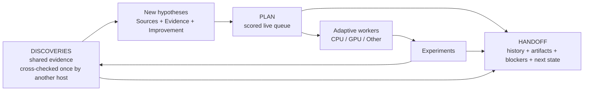
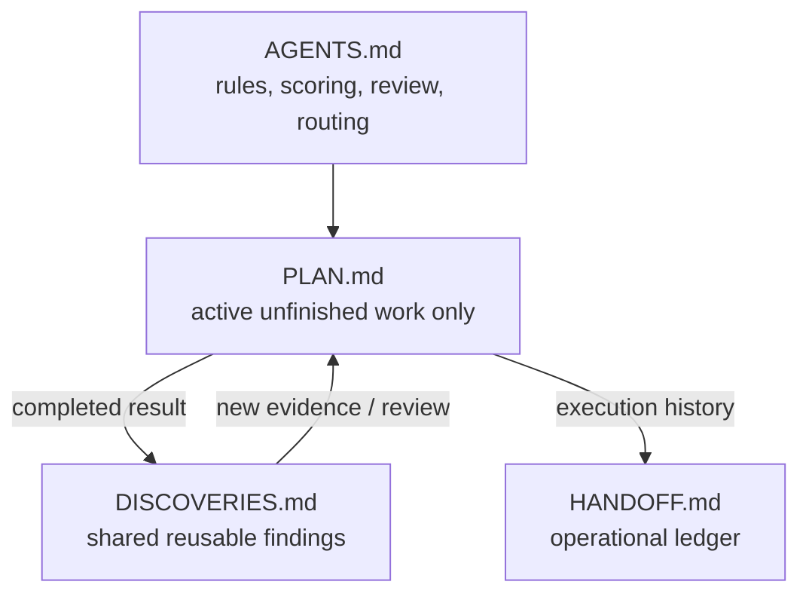
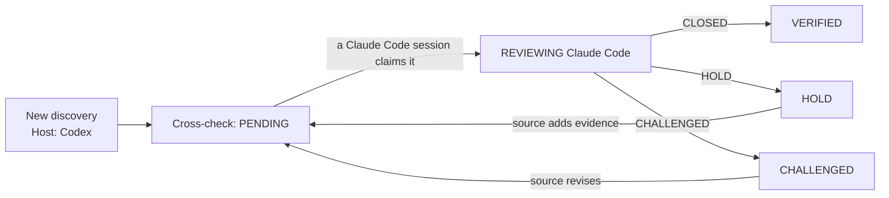

<p align="center">
  
</p>

<p align="center">
  <b>English</b> · <a href="README.ko.md">한국어</a> · <a href="README.zh-CN.md">简体中文</a> · <a href="README.ja.md">日本語</a>
</p>

# Research Orchestrator

A lightweight, hypothesis-driven research workflow for one or many AI agent sessions.

It deliberately uses only **four shared Markdown files** while adding a scored hypothesis queue, one-time cross-host verification, adaptive workers, and CPU/GPU/Other resource routing.

## Why use it?

- Resume long-running research across fresh sessions.
- Let multiple agents explore independently without sharing unfinished plans.
- Keep `plan.md` small by removing completed work.
- Never queue the same idea twice: failed hypotheses are recorded as negative discoveries, and every new item is checked against discoveries, the handoff log, and other agents' queues.
- Turn experiment results into reusable shared discoveries.
- Have a different host check each finding once — Codex's discovery is verified by Claude Code, and vice versa — instead of every session re-reviewing it.
- Preserve promising but incomplete findings with `HOLD`.
- Re-open discoveries as stronger hypotheses with explicit evidence and improvements.
- Scale from two workers to the machine's practical full load.

## Core workflow



A discovery can generate **zero, one, or many** new hypotheses. One hypothesis can also combine evidence from multiple discoveries.

## The four files



| File | Purpose |
| --- | --- |
| `agents.md` | Stable rules for reading, editing, scoring, review, and resource routing. |
| `plan.md` | **Only active unfinished work.** Each agent owns its own section and works from a scored queue. |
| `discoveries.md` | Shared reusable findings. Every agent reads it; each finding is cross-checked once by a different host. |
| `handoff.md` | Operational history, resumable state, artifacts, metrics, blockers, and next actions. |

Completed items **leave `plan.md`**. Their execution history goes to `handoff.md`, reusable knowledge goes to `discoveries.md`, and follow-up hypotheses return to `plan.md` with fresh scores.

## Templates and a worked example

Each file is created from a template. The worked example shows the same four files in the middle of a real project: two active slots (`Main` on Claude Code, `A` on Codex) and one released slot (`B`), a `VERIFIED` discovery, a discovery under review, a negative result, and the handoff log that produced them.

| File | Template | Worked example |
| --- | --- | --- |
| `agents.md` | [AGENTS.md.template](skills/research-orchestrator-skill/templates/AGENTS.md.template) | [agents.md](examples/cv-leakage-study/agents.md) |
| `plan.md` | [PLAN.md.template](skills/research-orchestrator-skill/templates/PLAN.md.template) | [plan.md](examples/cv-leakage-study/plan.md) |
| `discoveries.md` | [DISCOVERIES.md.template](skills/research-orchestrator-skill/templates/DISCOVERIES.md.template) | [discoveries.md](examples/cv-leakage-study/discoveries.md) |
| `handoff.md` | [HANDOFF.md.template](skills/research-orchestrator-skill/templates/HANDOFF.md.template) | [handoff.md](examples/cv-leakage-study/handoff.md) |

---

# Install

The repository packages the same skill for **Claude Code, Codex, and Google Antigravity**.

Repository:

```text
https://github.com/TaeyanG4/research-orchestrator-skill
```

## Claude Code

### Plugin marketplace install

Inside Claude Code:

```text
/plugin marketplace add TaeyanG4/research-orchestrator-skill
/plugin install research-orchestrator@research-orchestrator
```

Start a new Claude Code session after the first install.

### Project-only skill install

Clone or copy:

```text
skills/research-orchestrator-skill/
```

into:

```text
<project>/.claude/skills/research-orchestrator-skill/
```

## Codex

### Plugin marketplace install

From a terminal:

```bash
codex plugin marketplace add TaeyanG4/research-orchestrator-skill
codex
```

Inside Codex:

```text
/plugins
```

Select the **Research Orchestrator** marketplace and install `research-orchestrator`. Start a new chat before first use.

### Direct skill install

Repo-scoped:

```text
<project>/.codex/skills/research-orchestrator-skill/
```

User-scoped:

```text
~/.codex/skills/research-orchestrator-skill/
```

Copy the repository's `skills/research-orchestrator-skill/` directory into one of those locations.

## Google Antigravity

Clone the repository:

```bash
git clone https://github.com/TaeyanG4/research-orchestrator-skill.git
```

Then copy `skills/research-orchestrator-skill/` to one of these locations.

Project/workspace scope:

```text
<project>/.agents/skills/research-orchestrator-skill/
```

Global Antigravity scope:

```text
~/.gemini/config/skills/research-orchestrator-skill/
```

Antigravity CLI legacy/global location:

```text
~/.gemini/antigravity-cli/skills/research-orchestrator-skill/
```

Use `/skills` in Antigravity CLI to confirm discovery.

---

# Quick start

Initialize the four project files:

```bash
python <installed-skill>/scripts/init_research_orchestrator.py . -n "My Project"
```

Start with multiple independent agents (`2` → `Main, A`):

```bash
python <installed-skill>/scripts/init_research_orchestrator.py . -n "My Project" --agents 2
```

`--agents` also accepts an explicit list such as `Main,A,B`. The initializer rejects duplicate or non-standard names, creates missing files only, and never overwrites existing project files.

## Agent names

An agent name is a **work slot**, not the tool or model running it. Every host — Claude Code, Codex, Antigravity — uses the same names:

```text
Main, A, B, C, ... Z, AA, AB, ... ZZ
```

- Single-agent work always uses `Main`; each additional concurrent session takes the next unused letter, continuing with two-letter names after `Z`. Released slots are reused first, so new letters appear only when every existing slot is taken at once.
- Never name an agent `Claude`, `Codex`, `GPT`, `Gemini`, or any other host/model name.
- Any host may resume any slot. Which host owns a slot is recorded in `handoff.md`, not in the name:

```markdown
### Agent: Main
- Current host: Claude Code
- Current thread: H-Main-04
...

### Agent: A
- Current host: Codex
- Current thread: H-A-02
...
```

A slot is free when `Current host` reads `unassigned` or `released`. A new session takes the first free slot in order, sets `Current host` to its own host, and sets it back to `released` when it closes — so liveness is read from the file, never guessed.

Each completed-log event also records its `Host`, so the history shows which host did each step even after a slot changes hands.

IDs embed the owning agent so concurrent agents never collide:

| Object | Format | Examples |
| --- | --- | --- |
| Plan item | `H-<Agent>-<NN>` | `H-Main-01`, `H-A-07` |
| Discovery | `D-<Agent>-<NNN>` | `D-Main-001`, `D-B-014` |

## Reading rule

Each agent reads:

```text
agents.md
→ all discoveries.md
→ shared handoff log + its own active handoff
→ only its own detailed PLAN section
```

Agents do **not** read another active agent's detailed PLAN just to coordinate work. The only cross-section peeks are a dispatcher reading task metadata, the duplicate check reading item headings and `Hypothesis` lines, and a new session reading `Current host` lines to find a free slot.

---

# Standard PLAN format

Keep only active unfinished items.

```markdown
### H-Main-07 — Separate duplicate leakage from group leakage
- Sources: D-A-014, D-Main-021
- Hypothesis: exact duplicates explain most apparent group leakage
- Evidence: D-A-014 weakens after deduplication; D-Main-021 identifies repeated rows
- Improvement: isolate exact duplicates before constructing candidate groups
- Impact: 3
- Information: 3
- Confidence: 2
- Unblock: 3
- Diversity: 2
- Cost: 1
- Priority: 21
- Resource: CPU
- Parallel: YES
- Other: NONE
- Next test: compare random CV and GroupKFold after exact-duplicate removal
```

### Priority formula

Score every factor from 0 to 3.

```text
Priority = 2*Impact + 2*Information + Confidence + Unblock + Diversity + (3-Cost)
```

Run the highest score first unless blocked or explicitly overridden. Break ties by lower `Cost`, then higher `Information`.

When a discovery returns to PLAN, these fields are mandatory:

- `Sources` — which discoveries motivated it.
- `Evidence` — why it deserves another test.
- `Improvement` — what is materially different or stronger than the prior attempt.

Do not simply rerun an old idea under a new task ID.

### Duplicate check before adding an item

1. Search `discoveries.md`, including negative results — a failed hypothesis is always recorded there as `Finding: <claim> does not hold under <conditions>`. Skip `VERIFIED` claims unless you have a real `Improvement`; skip `CHALLENGED` ones until resolved.
2. Search the completed log in `handoff.md` and `docs/` for a prior attempt, and cite it.
3. Scan the other agents' plan sections, reading **only** item headings and `Hypothesis` lines. If it is already queued, do not add it.
4. Re-read `plan.md` right before writing; if the same item appeared meanwhile, keep the earlier one.

---

# Standard DISCOVERIES format

```markdown
## D-A-014 — Random CV may leak groups
- Source: A
- Host: Codex
- Cross-check: HOLD
- Finding: duplicated groups cross random folds
- Evidence: e014_group_check.py; random CV 0.9162 vs group CV 0.9027
- Implication: current validation may be optimistic
- Reviews:
  - Claude Code (Main): HOLD — plausible, but exact duplicates must be separated first
```

Verification is per **host**, not per agent. A discovery made on Codex is checked **once** by Claude Code (or another different host), and vice versa. Sessions on the same host share the same blind spots, so they do not re-review each other — ten Claude Code sessions never review the same finding ten times.

<p align="center">
  
</p>



`Cross-check` states:

- `PENDING` — no different host has reviewed it yet.
- `REVIEWING <Host> (<Agent>)` — a different-host session claimed the review, so nobody else duplicates it.
- `VERIFIED` — a different host reviewed it and recorded `CLOSED`.
- `HOLD` — plausible, but specific evidence or an improvement is needed first.
- `CHALLENGED` — a material contradiction, flaw, or missing assumption was found.

Rules:

- The source never reviews its own discovery, and same-host sessions do not review each other.
- One cross-host review is enough; add another only for high-impact or disputed findings.
- `HOLD` and `CHALLENGED` reviews must state what would make the discovery acceptable. When the source revises it, `Cross-check` returns to `PENDING`.
- `VERIFIED` discoveries may be used freely. Building on an unverified one must be stated in the plan item's `Evidence`; `CHALLENGED` ones are not used until resolved.
- With only one host available, a different slot on the same host may cross-check, starting its reason with `same host —`.

---

# Standard HANDOFF format

```markdown
### 2026-10-05 21:10 — Main — H-Main-07
- Host: Claude Code
- Action: cross-checked D-A-014; removed exact duplicates and rebuilt group candidates
- Result: random/group CV gap shrank from 0.0135 to 0.0041
- Evidence: experiments/e027_dedup_groups.py; outputs/e027.csv
- Discovery updates: D-A-014, D-Main-003
- Review verdict: D-A-014 HOLD
- Files/metrics: CV 0.9071 / 0.9030
- Resource: CPU
- Other executor: none
- New plan items: H-Main-08, H-Main-09
- Next resumable action: test near-duplicate clusters
```

When `handoff.md` becomes hard to scan, archive older completed entries under `docs/` and leave a short summary/link in the root handoff.

---

# Adaptive workers and compute routing

Start with **two workers** (`Main`, `A`) when parallelism is useful. Add workers only while independent high-value work and actual resource headroom remain.

Each PLAN item declares:

```text
Resource: CPU | GPU | EITHER
Parallel: YES | NO
Other: NONE | <external executor>
```

Example:

```text
Other: Kaggle
```

Routing order:

1. Idle GPU → highest-priority compatible GPU/EITHER item.
2. Idle CPU → highest-priority compatible CPU/EITHER item.
3. One local resource busy, the other idle → fill the idle one with worthwhile independent work.
4. Both local resources saturated → eligible work may overflow to `Other` when available and authorized.
5. Never run low-value work merely to keep hardware busy.
6. Scale down when RAM pressure, I/O contention, duplicated work, or lower throughput appears.

Worker count is not a goal. **Useful throughput is the goal.**

---

# Repository layout

```text
research-orchestrator-skill/
├── README.md
├── README.ko.md
├── README.zh-CN.md
├── README.ja.md
├── LICENSE
├── .gitignore
├── plugin.json
├── .agents/plugins/marketplace.json
├── .claude-plugin/
│   ├── plugin.json
│   └── marketplace.json
├── .codex-plugin/plugin.json
├── assets/readme/
│   ├── hero.svg
│   └── cross-host-check.svg
├── examples/cv-leakage-study/
│   ├── agents.md
│   ├── plan.md
│   ├── discoveries.md
│   └── handoff.md
├── scripts/validate_release.py
└── skills/
    └── research-orchestrator-skill/
        ├── SKILL.md
        ├── agents/openai.yaml
        ├── scripts/init_research_orchestrator.py
        ├── templates/
        │   ├── AGENTS.md.template
        │   ├── PLAN.md.template
        │   ├── DISCOVERIES.md.template
        │   └── HANDOFF.md.template
        └── assets/icon.svg
```

# Design principles

- **Minimal shared state** — four coordination documents, no per-agent folder hierarchy.
- **Independent exploration** — unfinished agent plans remain separated.
- **Shared evidence** — completed findings flow through discoveries.
- **Cross-host verification** — each discovery is checked once by a different host, not by every session.
- **Live queue only** — completed work does not accumulate in PLAN.
- **Evidence-backed retries** — returning discoveries state evidence and improvements.
- **Adaptive concurrency** — worker count follows useful work and compute headroom.
- **Host-agnostic agents** — `Main`, `A`, `B`, ... are slots any host can resume; hosts are recorded in handoff.
- **Safe shared edits** — re-read before patching shared files.

# Validation

Run the built-in consistency check before publishing changes:

```bash
python scripts/validate_release.py
```

A release should pass all of these checks:

- Plugin and marketplace manifests parse as valid JSON and share one version.
- No legacy skill name remains.
- Skill frontmatter contains only `name` and `description`.
- PLAN, DISCOVERIES, and HANDOFF examples in every README, SKILL.md, the templates, and the worked example use the exact field order.
- Discoveries record their `Host` and a valid `Cross-check` state; reviews use `<Host> (<Agent>)` with `CLOSED`, `HOLD`, or `CHALLENGED`, and never come from the source host (unless marked `same host —`).
- Resource values are `CPU`/`GPU`/`EITHER` in PLAN and `CPU`/`GPU`/`Other`/`none` in HANDOFF.
- Agent names are `Main`, `A`-`Z`, or `AA`-`ZZ`; IDs follow `H-<Agent>-NN` and `D-<Agent>-NNN`.
- Every README has the language switcher, its relative links resolve, and translations keep the same images and code-block structure.
- The worked example's `agents.md` matches what the initializer generates today.
- Initializer writes LF files, rejects duplicate or non-standard agent names, and never overwrites existing project files.

# License

MIT.

## Host documentation

- Claude Code plugins: https://docs.claude.com/en/docs/claude-code/plugins
- OpenAI plugin packaging and marketplaces: https://developers.openai.com/plugins/build/plugins
- Codex skills: https://developers.openai.com/blog/eval-skills
- Google Antigravity Skills: https://codelabs.developers.google.com/getting-started-with-antigravity-skills
