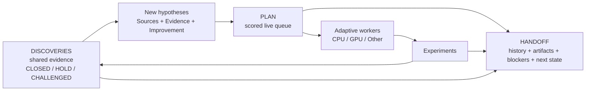
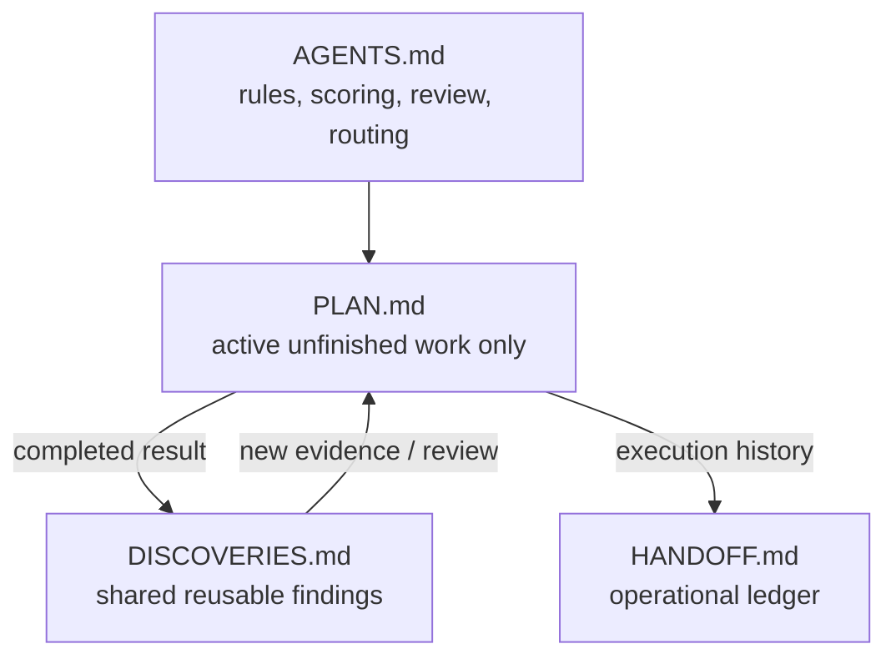

<p align="center">
  
</p>

# Research Orchestrator

A lightweight, hypothesis-driven research workflow for one or many AI agent sessions.

It deliberately uses only **four shared Markdown files** while adding a scored hypothesis queue, independent per-agent review, adaptive workers, and CPU/GPU/Other resource routing.

## Why use it?

- Resume long-running research across fresh sessions.
- Let multiple agents explore independently without sharing unfinished plans.
- Keep `plan.md` small by removing completed work.
- Turn experiment results into reusable shared discoveries.
- Re-check another agent's conclusion instead of inheriting it automatically.
- Preserve promising but incomplete findings with `HOLD`.
- Re-open discoveries as stronger hypotheses with explicit evidence and improvements.
- Scale from two workers to the machine's practical full load.

## Core workflow



A discovery can generate **zero, one, or many** new hypotheses. One hypothesis can also combine evidence from multiple discoveries.

## The four files



| File | Purpose |
| --- | --- |
| `agents.md` | Stable rules for reading, editing, scoring, review, and resource routing. |
| `plan.md` | **Only active unfinished work.** Each agent owns its own section and works from a scored queue. |
| `discoveries.md` | Shared reusable findings. Every agent reads it and records its own `CLOSED`, `HOLD`, or `CHALLENGED` verdict. |
| `handoff.md` | Operational history, resumable state, artifacts, metrics, blockers, and next actions. |

Completed items **leave `plan.md`**. Their execution history goes to `handoff.md`, reusable knowledge goes to `discoveries.md`, and follow-up hypotheses return to `plan.md` with fresh scores.

---

# Install

The repository packages the same skill for **Claude Code, Codex, and Google Antigravity**.

Repository:

```text
https://github.com/TaeyanG4/research-orchestrator-skill
```

## Claude Code

### Plugin marketplace install

Inside Claude Code:

```text
/plugin marketplace add TaeyanG4/research-orchestrator-skill
/plugin install research-orchestrator@research-orchestrator
```

Start a new Claude Code session after the first install.

### Project-only skill install

Clone or copy:

```text
skills/research-orchestrator-skill/
```

into:

```text
<project>/.claude/skills/research-orchestrator-skill/
```

## Codex

### Plugin marketplace install

From a terminal:

```bash
codex plugin marketplace add TaeyanG4/research-orchestrator-skill
codex
```

Inside Codex:

```text
/plugins
```

Select the **Research Orchestrator** marketplace and install `research-orchestrator`. Start a new chat before first use.

### Direct skill install

Repo-scoped:

```text
<project>/.codex/skills/research-orchestrator-skill/
```

User-scoped:

```text
~/.codex/skills/research-orchestrator-skill/
```

Copy the repository's `skills/research-orchestrator-skill/` directory into one of those locations.

## Google Antigravity

Clone the repository:

```bash
git clone https://github.com/TaeyanG4/research-orchestrator-skill.git
```

Then copy `skills/research-orchestrator-skill/` to one of these locations.

Project/workspace scope:

```text
<project>/.agents/skills/research-orchestrator-skill/
```

Global Antigravity scope:

```text
~/.gemini/config/skills/research-orchestrator-skill/
```

Antigravity CLI legacy/global location:

```text
~/.gemini/antigravity-cli/skills/research-orchestrator-skill/
```

Use `/skills` in Antigravity CLI to confirm discovery.

---

# Quick start

Initialize the four project files:

```bash
python <installed-skill>/scripts/init_research_orchestrator.py . -n "My Project"
```

Start with multiple independent agents:

```bash
python <installed-skill>/scripts/init_research_orchestrator.py . -n "My Project" --agents A,B
```

The initializer creates missing files only. Existing project files are never overwritten.

## Reading rule

Each agent reads:

```text
agents.md
→ all discoveries.md
→ shared handoff log + its own active handoff
→ only its own detailed PLAN section
```

Agents do **not** read another active agent's detailed PLAN just to coordinate work.

---

# Standard PLAN format

Keep only active unfinished items.

```markdown
### H-B07 — Separate duplicate leakage from group leakage
- Sources: D-014, D-021
- Hypothesis: exact duplicates explain most apparent group leakage
- Evidence: D-014 weakens after deduplication; D-021 identifies repeated rows
- Improvement: isolate exact duplicates before constructing candidate groups
- Impact: 3
- Information: 3
- Confidence: 2
- Unblock: 3
- Diversity: 2
- Cost: 1
- Priority: 21
- Resource: CPU
- Parallel: YES
- Other: NONE
- Next test: compare random CV and GroupKFold after exact-duplicate removal
```

### Priority formula

Score every factor from 0 to 3.

```text
Priority = 2*Impact + 2*Information + Confidence + Unblock + Diversity + (3-Cost)
```

Run the highest score first unless blocked or explicitly overridden. Break ties by lower `Cost`, then higher `Information`.

When a discovery returns to PLAN, these fields are mandatory:

- `Sources` — which discoveries motivated it.
- `Evidence` — why it deserves another test.
- `Improvement` — what is materially different or stronger than the prior attempt.

Do not simply rerun an old idea under a new task ID.

---

# Standard DISCOVERIES format

```markdown
## D-014 — Random CV may leak groups
- Source: Agent A
- Finding: duplicated groups cross random folds
- Evidence: e014_group_check.py; random CV 0.9162 vs group CV 0.9027
- Implication: current validation may be optimistic
- Reviews:
  - Agent A: CLOSED — source experiment consistently reproduces the effect
  - Agent B: HOLD — plausible, but exact duplicates must be separated first
  - Agent C: CHALLENGED — effect disappears after a deduplication control
```

Per-agent verdicts:

- `CLOSED` — this agent currently accepts the finding after meaningful review.
- `HOLD` — promising or plausible, but more evidence or a specific improvement is needed.
- `CHALLENGED` — this agent found a material contradiction, flaw, or missing assumption.
- no entry — this agent has not reviewed it.

There is **no global CLOSED**. Agent A's `CLOSED` does not automatically become Agent B's conclusion.

A `HOLD` review should state what evidence, condition, or improvement would make the discovery worth revisiting.

---

# Standard HANDOFF format

```markdown
### 2026-10-05 21:10 — Agent B — H-B07
- Action: removed exact duplicates and rebuilt group candidates
- Result: random/group CV gap shrank from 0.0135 to 0.0041
- Evidence: experiments/e027_dedup_groups.py; outputs/e027.csv
- Discovery updates: D-014, D-028
- Review verdict: B:HOLD
- Files/metrics: CV 0.9071 / 0.9030
- Resource: CPU
- Other executor: none
- New plan items: H-B08, H-B09
- Next resumable action: test near-duplicate clusters
```

When `handoff.md` becomes hard to scan, archive older completed entries under `docs/` and leave a short summary/link in the root handoff.

---

# Adaptive workers and compute routing

Start with **two workers** when parallelism is useful. Add workers only while independent high-value work and actual resource headroom remain.

Each PLAN item declares:

```text
Resource: CPU | GPU | EITHER
Parallel: YES | NO
Other: NONE | <external executor>
```

Example:

```text
Other: Kaggle
```

Routing order:

1. Idle GPU → highest-priority compatible GPU/EITHER item.
2. Idle CPU → highest-priority compatible CPU/EITHER item.
3. One local resource busy, the other idle → fill the idle one with worthwhile independent work.
4. Both local resources saturated → eligible work may overflow to `Other` when available and authorized.
5. Never run low-value work merely to keep hardware busy.
6. Scale down when RAM pressure, I/O contention, duplicated work, or lower throughput appears.

Worker count is not a goal. **Useful throughput is the goal.**

---

# Repository layout

```text
research-orchestrator-skill/
├── README.md
├── LICENSE
├── plugin.json
├── .agents/plugins/marketplace.json
├── .claude-plugin/
│   ├── plugin.json
│   └── marketplace.json
├── .codex-plugin/plugin.json
├── assets/readme/
│   └── hero.webp
└── skills/
    └── research-orchestrator-skill/
        ├── SKILL.md
        ├── agents/openai.yaml
        ├── scripts/init_research_orchestrator.py
        ├── templates/
        │   ├── AGENTS.md.template
        │   ├── PLAN.md.template
        │   ├── DISCOVERIES.md.template
        │   └── HANDOFF.md.template
        └── assets/icon.svg
```

# Design principles

- **Minimal shared state** — four coordination documents, no per-agent folder hierarchy.
- **Independent exploration** — unfinished agent plans remain separated.
- **Shared evidence** — completed findings flow through discoveries.
- **Per-agent judgment** — `CLOSED`, `HOLD`, and `CHALLENGED` are independent verdicts.
- **Live queue only** — completed work does not accumulate in PLAN.
- **Evidence-backed retries** — returning discoveries state evidence and improvements.
- **Adaptive concurrency** — worker count follows useful work and compute headroom.
- **Safe shared edits** — re-read before patching shared files.

# Validation

Run the built-in consistency check before publishing changes:

```bash
python scripts/validate_release.py
```

A release should pass all of these checks:

- Skill frontmatter contains only `name` and `description`.
- PLAN fields match the template exactly.
- DISCOVERIES uses only `CLOSED`, `HOLD`, `CHALLENGED`, or no review.
- HANDOFF uses the documented event fields.
- Resource metadata uses `CPU`, `GPU`, `EITHER`, and `Other`.
- No legacy `context-continuity` naming remains.
- Initializer never overwrites existing project files.
- Plugin and marketplace manifests parse as valid JSON.

# License

MIT.

## Host documentation

- Claude Code plugin installation: https://docs.anthropic.com/
- OpenAI plugin packaging and marketplaces: https://developers.openai.com/plugins/build/plugins
- Codex skills: https://developers.openai.com/blog/eval-skills
- Google Antigravity Skills: https://codelabs.developers.google.com/getting-started-with-antigravity-skills
