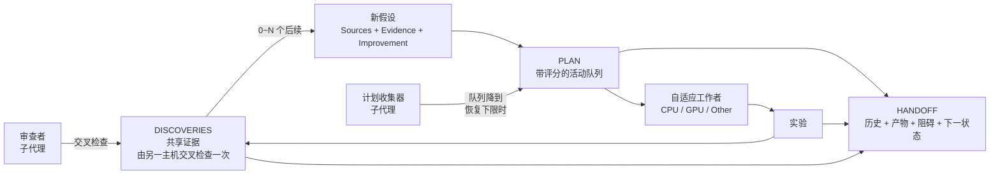
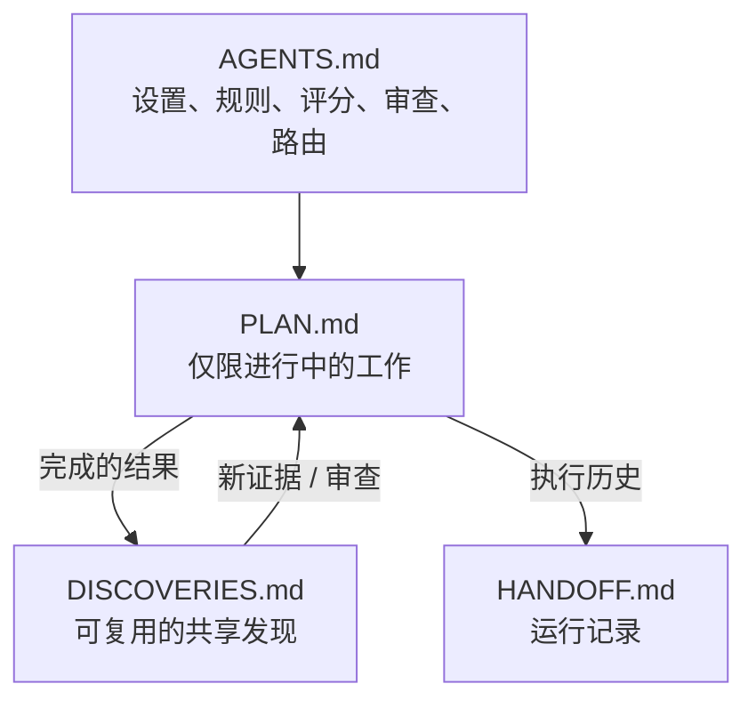
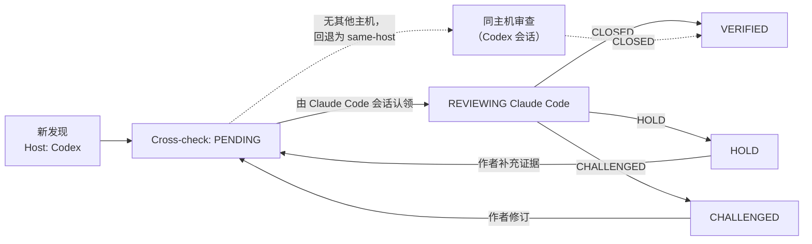

<p align="center">
  
</p>

<p align="center">
  <a href="README.md">English</a> · <a href="README.ko.md">한국어</a> · <b>简体中文</b> · <a href="README.ja.md">日本語</a>
</p>

> 本文档是[英文 README](README.md) 的译本，如有出入以英文原文为准。字段名、状态值和命令需要由代理原样使用，因此保留英文。

# Research Orchestrator

一个轻量的、以假设为驱动的研究工作流，适用于单个或多个 AI 代理会话。

它刻意只使用**四个共享 Markdown 文件**，同时提供带评分的假设队列、跨主机一次性交叉检查、自适应工作者以及 CPU/GPU/Other 资源路由。

## 为什么使用它？

用 AI 代理做研究通常在同样的地方出问题：会话结束后上下文就没了，两个会话重复同一个实验，一个结论仅因某个模型这么说就被采信，没有人能说清当前最佳结果到底是什么。Research Orchestrator 用四个纯 Markdown 文件和一小组规则解决这些问题，让工作跨越任何会话、任何平台、任何人都能延续。

<p align="center">
  
</p>

**人与代理的协作**

- 人和 AI 代理通过同一组文件推进同一个项目：Claude Code 上的 `kim`、Codex 上的 `lee`，以及只阅读和编辑设置的第三个人，看到的都是同一状态。
- 代理槽位（`A`、`B`……）不属于任何平台、模型或个人。任何主机或用户都可以接续任何槽位；谁做了什么是记录下来的，而不是猜出来的。
- 每个发现由另一个平台检查一次——Codex 的发现由 Claude Code 验证，反之亦然——因此结论从不依赖单一模型的盲点。这项工作也可以交给审查子代理。
- git 同步让多台机器共享文件；计算资源占用记录阻止两个会话同时在同一块 GPU 上启动任务。

**可持续的自动化研究**

- 循环持续运行：队列变少时，收集子代理用多样且去重的假设补充队列；代理在空闲的计算资源上运行合适的实验；每个结果——正面、负面或无定论——都成为一个发现，并决定下一步测试。
- 不重复、不丢失：每个完成的实验恰好留下一个发现，每个新条目都与之比对，当前最佳结果始终引用确立它的发现。
- 空闲的代理按固定顺序找活干（交叉检查、接手、收集），被阻塞的代理在等待时做其他有价值的工作；绝不为了显得忙碌而制造低价值工作。

**定制与工程化**

- 在 `agents.md` 中定制循环：平台、git 同步、收集器和审查者模型、队列上下限、交叉检查回退，都是用户随时可以编辑的设置行。
- 代理工程（agentic engineering）：规则是为代理无人值守地执行而写的——读什么、改什么、何时提问——而不是为人类监督而写。
- 循环工程（loop engineering）：收集 → 运行 → 验证 → 学习的周期、其上下限和停止条件都是显式且可调的。
- 治具工程（harness engineering）：`check_project.py` 在会话开始新工作前确认四个文件彼此一致，`validate_release.py` 保持技能本身的一致性；两者都能捕获原本会悄悄累积的偏差。

## 为什么要跨平台

有两个设计选择源于语言模型的行为方式，这也是这个技能跨平台运行而不是局限在一个平台内的原因。

- **每个发现都由另一个平台检查一次。** 模型倾向于认同它正在对话的对象——用户的立场，或被要求确认的结论——而延续同一段对话的会话会继承这种倾向。另一个平台上的会话既不共享做出该发现的会话的对话，也不共享它的盲点，因此它的审查是真正的第二意见而非回声。这就是为什么验证以主机为单位、同主机审查必须注明、以及同一平台上的十个会话永远不必互相复审。
- **接力的是假设，不只是代码。** 当 Codex 的假设 H1 成为发现、Claude Code 接续它时，Claude 自己的假设 H2 建立在其上：(H1, H2) 这一对是任何一个平台都无法单独产生的推理链，并能得出任何一方都不会单独提出的假设。反方向同样成立。因此每个发现都要求零个或多个后续假设，每个假设引用它所结合的发现，而接手的条目在标题中保留这条链。

共享笔记也容易腐坏：它们会膨胀、会针对已不存在的状态下结论、还会不小心关闭整片领域。在这里，`plan.md` 只保留进行中的条目，每个事实只有一个归属，当前最佳始终引用确立它的发现，失败的想法通过提出真正的 `Improvement` 重新打开而不是永久禁止，一致性检查器会在四个文件出现分歧的那一刻报告。

<p align="center">
  
</p>

## 核心工作流



一个发现可以产生**零个、一个或多个**新假设。一个假设也可以结合多个发现的证据。

## 四个文件



| 文件 | 用途 |
| --- | --- |
| `agents.md` | 关于读取、编辑、评分、审查和资源路由的稳定规则。 |
| `plan.md` | **仅包含进行中的未完成工作。** 每个代理拥有自己的分区，并按评分队列工作。 |
| `discoveries.md` | **已知的内容**：结论、数字、解释和验证状态。每个完成的实验都会留下一条；每条由另一主机交叉检查一次。 |
| `handoff.md` | **发生了什么、从哪里继续**：谁、何时、哪个主机、产物路径、当前最佳等项目级数值，以及每个槽位的恢复点。只用 ID 指向发现，不重复其内容。 |

已完成的条目会**离开 `plan.md`**。无论结果如何，每个条目都会留下一个发现和一条指向它的 handoff 事件，后续假设以新的评分回到 `plan.md`。

## 模板与完整示例

每个文件都由模板生成。完整示例展示了进行中的项目里这四个文件实际填写后的样子：两个活动槽位（Claude Code 上的 `A`、Codex 上的 `B`）和一个已释放的槽位（`C`），一个 `VERIFIED` 的发现、一个正在审查的发现、一个附理由记录“零后续”的负面结果、一次同主机接手，以及产生它们的 handoff 日志。

| 文件 | 模板 | 完整示例 |
| --- | --- | --- |
| `agents.md` | [AGENTS.md.template](skills/research-orchestrator-skill/templates/AGENTS.md.template) | [agents.md](examples/cv-leakage-study/agents.md) |
| `plan.md` | [PLAN.md.template](skills/research-orchestrator-skill/templates/PLAN.md.template) | [plan.md](examples/cv-leakage-study/plan.md) |
| `discoveries.md` | [DISCOVERIES.md.template](skills/research-orchestrator-skill/templates/DISCOVERIES.md.template) | [discoveries.md](examples/cv-leakage-study/discoveries.md) |
| `handoff.md` | [HANDOFF.md.template](skills/research-orchestrator-skill/templates/HANDOFF.md.template) | [handoff.md](examples/cv-leakage-study/handoff.md) |

---

# 安装

本仓库为 **Claude Code、Codex 和 Google Antigravity** 打包了同一个技能。

仓库：

```text
https://github.com/TaeyanG4/research-orchestrator-skill
```

## Claude Code

### 通过插件市场安装

在 Claude Code 中：

```text
/plugin marketplace add TaeyanG4/research-orchestrator-skill
/plugin install research-orchestrator@research-orchestrator
```

首次安装后请启动新的 Claude Code 会话。

### 仅项目内安装技能

将以下目录：

```text
skills/research-orchestrator-skill/
```

克隆或复制到：

```text
<project>/.claude/skills/research-orchestrator-skill/
```

## Codex

### 通过插件市场安装

在终端中：

```bash
codex plugin marketplace add TaeyanG4/research-orchestrator-skill
codex
```

在 Codex 中：

```text
/plugins
```

选择 **Research Orchestrator** 市场并安装 `research-orchestrator`。首次使用前请开始新的对话。

### 直接安装技能

仓库范围：

```text
<project>/.codex/skills/research-orchestrator-skill/
```

用户范围：

```text
~/.codex/skills/research-orchestrator-skill/
```

将仓库中的 `skills/research-orchestrator-skill/` 目录复制到上述任一位置。

## Google Antigravity

克隆仓库：

```bash
git clone https://github.com/TaeyanG4/research-orchestrator-skill.git
```

然后将 `skills/research-orchestrator-skill/` 复制到以下任一位置。

项目/工作区范围：

```text
<project>/.agents/skills/research-orchestrator-skill/
```

Antigravity 全局范围：

```text
~/.gemini/config/skills/research-orchestrator-skill/
```

Antigravity CLI 旧版/全局位置：

```text
~/.gemini/antigravity-cli/skills/research-orchestrator-skill/
```

在 Antigravity CLI 中使用 `/skills` 确认技能已被识别。

---

# 快速开始

首次使用时，代理会询问三个问题——你的名字、使用哪些平台、git 同步方式（见下文*设置问题*）——然后初始化项目。你也可以自己运行初始化脚本。一个人、一个平台、不用 git：

```bash
python <installed-skill>/scripts/init_research_orchestrator.py . -n "My Project" --user kim --platform single --platforms "Claude Code" --git off
```

两个平台同时运行两个代理（`2` → `A, B`），通过 git 共享：

```bash
python <installed-skill>/scripts/init_research_orchestrator.py . -n "My Project" --agents 2 --user kim --platform multi --platforms "Claude Code, Codex" --git push --collector "Claude Code/sonnet" --queue-limits 50,5 --reviewer "Codex/sol" --fallback wait
```

`--agents` 也接受 `A,B,C` 这样的显式名称列表。初始化脚本会拒绝重复或非标准的名称，只创建缺失的文件，绝不覆盖已有的项目文件。

之后在每次会话开始和结束前运行 `python <installed-skill>/scripts/check_project.py .`（见下文*一致性检查*）。

## 设置问题

| 问题 | 选项 | 影响 |
| --- | --- | --- |
| 你的名字 | 一个词，例如 `kim`、`user1` | 记录在 `Users`、`Current user` 和每个事件的 `User` 中，让多人共用一个项目 |
| 平台 | `multi` — 同时使用多个平台（例如 Claude Code 和 Codex）<br>`single` — 单一平台<br>`adaptive` — 视情况而定 | 据此生成 `agents.md`：`single` 去掉跨主机规则，由不同槽位交叉检查；`multi` 由不同主机交叉检查；`adaptive` 优先其他主机，没有时退回其他槽位 |
| Git 同步 | `push` — 自动提交并推送<br>`commit` — 仅本地提交<br>`off` — 不使用 git | `push` 会在编辑前 `git pull --rebase`，并在每次关联变更和会话结束时提交并推送。多人或多台机器协作时需要 若项目不是 git 仓库，则报告并切换为 `off`；代理绝不运行 `git init`。 |
| 计划收集器 | `off`，或平台/模型，例如 `Claude Code/sonnet`、`Codex/sol`；以及队列上下限（默认 `50,5`） | 子代理把多样的研究候选收集进 `plan.md`：队列降到恢复下限（5）时开始收集，达到停止上限（50）时停止 |
| 审查者 | `off`，或平台/模型，例如 `Codex/sol` | 由审查子代理负责已完成工作的交叉检查，主代理继续做实验 |
| 交叉检查回退 | `wait` 或 `same-host` | 队列用完、只剩需要其他平台验证的交叉检查时：保持不动，或用同平台模型执行（`same host —`） |

<p align="center">
  
</p>

答案会写入 `agents.md` 顶部的 `## Project settings`，之后的会话直接读取这些设置，只询问用户名。这些行随时可以直接编辑：收集器、队列上下限、审查者和回退方式立即生效；修改平台模式、平台或 git 同步后，运行以下命令重新生成规则（它只重写 `agents.md`，若规则正文被手动修改，没有 `--force` 时拒绝覆盖）：

```bash
python <installed-skill>/scripts/init_research_orchestrator.py . --reconfigure --platform adaptive --git push
```

## 代理名称

每个会话中都会出现三种名称，请勿混淆：

| 名称 | 含义 | 示例 |
| --- | --- | --- |
| 代理（槽位） | 工作槽位 | `A`、`B`、`AA` |
| 主机 | 平台，而非模型 | `Claude Code`、`Codex` |
| 用户 | 运行会话的人 | `kim`、`user1` |

其他用户正在运行的槽位，永远不会成为接手的来源。


代理名称是一个**工作槽位**，而不是运行它的工具或模型。所有主机——Claude Code、Codex、Antigravity——都使用相同的名称：

```text
A, B, C, ... Z, AA, AB, ... ZZ
```

- 单代理工作始终使用 `A`；每增加一个并发会话，就使用下一个未使用的字母，`Z` 之后继续使用两个字母的名称。已释放的槽位会被优先复用，因此只有当所有现有槽位同时被占用时才会出现新字母。
- 不要用 `Claude`、`Codex`、`GPT`、`Gemini` 或任何其他主机/模型名称为代理命名。
- 任何主机都可以接续任何槽位。槽位由哪个主机持有记录在 `handoff.md` 中，而不是体现在名称里：

```markdown
### Agent: A
- Current host: Claude Code
- Current user: kim
- Current thread: H-A-04
...

### Agent: B
- Current host: Codex
- Current user: lee
- Current thread: H-B-02
...
```

当 `Current host` 为 `unassigned` 或 `released` 时，该槽位是空闲的。新会话按顺序占用第一个空闲槽位（跳过仍留有其他主机计划条目的槽位），把 `Current host` 设为自己的主机，并在结束时改回 `released`——因此会话是否存活是从文件中读取的，而不是猜测的。

每条完成日志事件也会记录其 `Host`，因此即使槽位易主，历史中仍能看出每一步由哪个主机完成。

ID 中包含所属代理，因此并发代理之间的 ID 永远不会冲突：

| 对象 | 格式 | 示例 |
| --- | --- | --- |
| 计划条目 | `H-<Agent>-<NN>` | `H-A-01`, `H-B-07` |
| 发现 | `D-<Agent>-<NNN>` | `D-A-001`, `D-C-014` |

## 后续计划与接手

- **每个发现都要规划后续。** 代理每次记录发现（新结果、负面结果或交叉检查结论）时，都要决定下一步测试什么：新计划条目可以是零个、一个或多个，且每个都要通过重复检查。它还会重新评分或删除受该发现影响的自有条目。零个也是有效答案，但必须附上理由，记录为 `New plan items: none — <reason>`。
- **队列用完时**，按以下顺序寻找工作：重新阅读自己的分区 → 认领另一主机的 `PENDING` 交叉检查 → 接手同一主机槽位的条目 → 基于判断的跨主机接手（最多一个） → 从发现中推导新假设 → 记录后释放槽位。
- **接手默认只在同一主机内进行。** 主机指平台而非模型：使用不同模型的两个 Claude Code 会话属于同一主机。如果 `A` 的队列已空，而同一主机的 `C` 仍有排队条目，`A` 会把优先级最高的条目移到自己的分区并使用自己的下一个 ID（`H-C-02` 变为 `### H-A-04 — … (from H-C-02)`），并记录这次移动。它绝不接手原所有者 `Current thread` 中的条目，也不接手 `Active compute` 已占用的条目。
- **基于判断的跨主机接手。** 由其他主机排队的条目通常留给该主机。作为例外，当更近的工作都已用完、来源槽位已释放（绝不能是另一主机正在运行的会话）、该条目的 `Priority` ≥ 15 且明显优于任何新假设时，代理可以接手**一个**这样的条目，并用一行记录理由：`took over H-C-01 from C (cross-host: Codex → Claude Code; reason: …) as H-A-12`。完成后重新按顺序寻找工作。用户可以调整阈值、禁止此做法或批准特定条目。

<p align="center">
  
</p>

## 阅读规则

每个代理按以下顺序阅读：

```text
agents.md
→ all discoveries.md
→ shared handoff log + its own active handoff
→ only its own detailed PLAN section
```

代理**不会**仅为了协调工作而阅读其他活动代理的详细 PLAN。跨分区查看的例外只有四种：调度器读取任务元数据、重复检查读取条目标题和 `Hypothesis` 行、会话读取 `Current host` 和 `Current thread` 行以寻找空闲槽位或可接手的条目，以及读取自己决定接手的那一个条目。

---

# 标准 PLAN 格式

只保留进行中的未完成条目。

```markdown
### H-A-07 — Separate duplicate leakage from group leakage
- Sources: D-B-014, D-A-021
- Hypothesis: exact duplicates explain most apparent group leakage
- Evidence: D-B-014 weakens after deduplication; D-A-021 identifies repeated rows
- Improvement: isolate exact duplicates before constructing candidate groups
- Impact: 3
- Information: 3
- Confidence: 2
- Unblock: 3
- Diversity: 2
- Cost: 1
- Priority: 21
- Resource: CPU
- Parallel: YES
- Other: NONE
- Next test: compare random CV and GroupKFold after exact-duplicate removal
```

### 优先级公式

每个因素评分 0 到 3。

```text
Priority = 2*Impact + 2*Information + Confidence + Unblock + Diversity + (3-Cost)
```

除非被阻塞或被明确指定，否则先运行分数最高的条目。分数相同时，先选 `Cost` 较低的，再选 `Information` 较高的。

当发现重新回到 PLAN 时，以下字段为必填：

- `Sources` — 由哪些发现引出。
- `Evidence` — 为什么值得再次测试。
- `Improvement` — 与之前的尝试相比，有哪些实质性的不同或更强之处。

不要只是换一个新任务 ID 重新运行旧想法。

### 添加条目前的重复检查

1. 搜索 `discoveries.md`——所有完成的实验都在其中，无论是正面、负面（`Finding: <claim> does not hold under <conditions>`）还是无定论。对于 `VERIFIED` 的结论，除非有真正的 `Improvement`，否则跳过；对于 `CHALLENGED` 的结论，在问题解决前跳过。
2. 浏览其他代理的计划分区，**只**阅读条目标题和 `Hypothesis` 行。如果已在队列中，就不要添加。
3. 写入前重新读取 `plan.md`；如果在此期间出现了相同条目，保留先出现的那个。

---

# 标准 DISCOVERIES 格式

```markdown
## D-B-014 — Random CV may leak groups
- Source: B
- Host: Codex
- User: lee
- Date: 2026-10-05
- Cross-check: HOLD
- Finding: duplicated groups cross random folds
- Evidence: e014_group_check.py; random CV 0.9162 vs group CV 0.9027
- Implication: current validation may be optimistic
- Reviews:
  - Claude Code (A): HOLD — plausible, but exact duplicates must be separated first
```

验证以**主机**为单位，而不是以代理为单位。在 Codex 上产生的发现由 Claude Code（或其他不同的主机）检查**一次**，反之亦然。同一主机上的会话共享相同的盲点，因此不会互相重新审查——十个 Claude Code 会话绝不会把同一个发现审查十次。

<p align="center">
  
</p>



`Cross-check` 状态：

- `PENDING` — 尚无其他主机审查。
- `REVIEWING <Host> (<Agent>)` — 另一主机的会话已认领审查，其他会话不会重复审查。
- `VERIFIED` — 另一主机已审查并记录 `CLOSED`。
- `HOLD` — 看似合理，但需要先补充具体证据或改进。
- `CHALLENGED` — 发现了实质性的矛盾、缺陷或缺失的假设。

规则：

- 作者从不审查自己的发现，同一主机上的会话也不互相审查。
- 一次跨主机审查就足够；只有对影响重大或存在争议的发现才追加审查。
- `HOLD` 和 `CHALLENGED` 审查必须说明满足什么条件才能接受该发现。作者修订后，`Cross-check` 回到 `PENDING`。
- `VERIFIED` 的发现可以自由使用。以未验证的发现为依据时，必须在计划条目的 `Evidence` 中注明；`CHALLENGED` 的发现在问题解决前不得使用。
- 只有一个主机可用时，可由同一主机上的其他槽位进行交叉检查，并以 `same host —` 开头说明理由。

---

# 标准 HANDOFF 格式

```markdown
### 2026-10-05 21:10 — A — H-A-07
- Host: Claude Code
- User: kim
- Action: cross-checked D-B-014; removed exact duplicates and rebuilt group candidates
- Result: duplicates explain most of the gap; see D-A-003 and the review on D-B-014
- Artifacts: experiments/e027_dedup_groups.py; outputs/e027.csv
- Discovery updates: D-B-014 (review), D-A-003
- Review verdict: D-B-014 HOLD
- Resource: CPU
- Other executor: none
- New plan items: H-A-08, H-A-09
```

当 `handoff.md` 变得难以浏览时，把较早的已完成条目归档到 `docs/` 下，并在根目录的 handoff 中留下简短摘要和链接。

事件记录发生了什么，对知识只做**指向**，不重复内容。`Result` 是指向发现的一行，`Artifacts` 只列路径，也没有“下一步”行——每个槽位活动分区中的 `Next action` 是唯一的下一步。

### 信息放在哪里

| 信息 | 存放位置 | 其他地方 |
| --- | --- | --- |
| 结论、数字、解释 | `discoveries.md` | handoff 的 `Result` 指向发现 ID |
| 验证状态与理由 | `discoveries.md`（`Cross-check`、`Reviews`） | handoff 的 `Review verdict` 只写 ID 和结论 |
| 谁、何时、哪个主机、做了什么 | `handoff.md` 事件 | — |
| 生成或修改的文件 | `handoff.md` 的 `Artifacts` | 发现的 `Evidence` 只引用复现所需的文件 |
| 当前最佳等项目级数值 | `handoff.md` 的 Shared state（引用发现） | 绝不写在 `plan.md` |
| 下一步要测试什么 | `plan.md` 的 `Next test` | handoff 只写计划条目 ID |

### 一致性检查

在会话开始、接手之后以及结束之前运行内置检查脚本：

```bash
python <installed-skill>/scripts/check_project.py .
```

它会报告文件之间的不一致：缺少计划或 handoff 分区的活动代理、handoff 说已排队但 `plan.md` 中不存在的条目、已完成或已移交却仍留在队列中的条目、写进 `plan.md` 的“冠军”之类的项目级数值、过时或未引用来源的 `Current best`，以及与审查记录不符的交叉检查状态。每个问题都标注了负责的代理；代理修复自己的问题，并把其他代理的问题记在 `Open consistency issues` 下。

---

# 自适应工作者与计算路由

在并行有用时，从**两个工作者**（`A`、`B`）开始。只有在仍有独立的高价值工作和实际资源余量时才增加工作者。

每个 PLAN 条目声明：

```text
Resource: CPU | GPU | EITHER
Parallel: YES | NO
Other: NONE | <external executor>
```

示例：

```text
Other: Kaggle
```

路由顺序：

1. GPU 空闲 → 选择优先级最高的兼容 GPU/EITHER 条目。
2. CPU 空闲 → 选择优先级最高的兼容 CPU/EITHER 条目。
3. 一个本地资源繁忙、另一个空闲 → 用有价值的独立工作填满空闲的那个。
4. 两个本地资源都饱和 → 在可用且已授权时，符合条件的工作可以溢出到 `Other`。
5. 绝不为了让硬件忙碌而运行低价值工作。
6. 出现内存压力、I/O 争用、重复工作或吞吐量下降时减少工作者。

工作者数量不是目标。**有效吞吐量才是目标。**

### 计算资源占用与等待

- **启动前先占用。** handoff Shared state 中的 `Active compute` 记录谁占用了哪种资源：`GPU — A (H-A-04, since 2026-10-05 18:20)`。启动重任务前，同时检查占用记录和实际使用情况（`nvidia-smi`、任务管理器）；占用和启动在同一步完成，并在记录任务结束的同一步移除占用。两个会话同时看到 GPU 空闲时，正是这条占用记录阻止它们同时启动。
- **资源繁忙就等待，但不停工。** 除非条目是 `Parallel: YES` 且实测的空闲内存和负载明显足够，否则不要与正在运行的任务同时启动。等待期间：运行适合空闲资源的条目（或已获许可的 `Other` 执行器）→ 做不需要重计算的工作（交叉检查、准备等待中的实验并做小样本测试、分析结果并规划后续、重新评分）→ 只有在无事可做时，才记录 `Blocker: waiting for GPU (held by A …)`，并按正在运行任务的时长间隔重新检查。
- **过期占用。** 被已释放槽位持有、或对应条目已不在 `plan.md` 中的占用即为过期，检查脚本会报告。会话自己的任务仍在运行时不会释放槽位。

---

# 仓库结构

```text
research-orchestrator-skill/
├── README.md
├── README.ko.md
├── README.zh-CN.md
├── README.ja.md
├── LICENSE
├── .gitignore
├── plugin.json
├── .agents/plugins/marketplace.json
├── .claude-plugin/
│   ├── plugin.json
│   └── marketplace.json
├── .codex-plugin/plugin.json
├── assets/readme/
│   ├── hero.svg
│   ├── cross-host-check.svg
│   ├── take-over.svg
│   ├── setup.svg
│   ├── why-use.webp
│   └── hypothesis-relay.webp
├── examples/cv-leakage-study/
│   ├── agents.md
│   ├── plan.md
│   ├── discoveries.md
│   └── handoff.md
├── scripts/validate_release.py
└── skills/
    └── research-orchestrator-skill/
        ├── SKILL.md
        ├── agents/openai.yaml
        ├── scripts/
        │   ├── init_research_orchestrator.py
        │   └── check_project.py
        ├── templates/
        │   ├── AGENTS.md.template
        │   ├── PLAN.md.template
        │   ├── DISCOVERIES.md.template
        │   └── HANDOFF.md.template
        └── assets/icon.svg
```

# 设计原则

- **最小共享状态** — 四个协调文档，没有按代理划分的文件夹层级。
- **独立探索** — 未完成的代理计划保持分离。
- **共享证据** — 已完成的发现通过 discoveries 流转。
- **跨主机验证** — 每个发现由另一主机检查一次，而不是由每个会话检查。
- **只保留活动队列** — 已完成的工作不会在 PLAN 中堆积。
- **基于证据的重试** — 重新提出的发现要说明证据和改进。
- **自适应并发** — 工作者数量取决于有用的工作和计算余量。
- **与主机无关的代理** — `A`、`B`、`C`……是任何主机都能接续的槽位；主机记录在 handoff 中。
- **安全的共享编辑** — 修改共享文件前先重新读取。

# 验证

发布变更前运行内置的一致性检查：

```bash
python scripts/validate_release.py
```

一个发布版本应通过以下所有检查：

- 插件和市场清单是有效的 JSON，且版本一致。
- 不再残留旧的技能名称。
- 技能 frontmatter 只包含 `name` 和 `description`。
- README（含译本）、SKILL.md、模板和完整示例中的 PLAN、DISCOVERIES、HANDOFF 使用准确的字段顺序。
- 发现记录了 `Host` 和有效的 `Cross-check` 状态；审查使用 `<Host> (<Agent>)` 格式及 `CLOSED`、`HOLD` 或 `CHALLENGED`，且不来自作者所在的主机（标注 `same host —` 的除外）。
- Resource 值在 PLAN 中为 `CPU`/`GPU`/`EITHER`，在 HANDOFF 中为 `CPU`/`GPU`/`Other`/`none`。
- 实际的 handoff 事件会列出发现更新和新计划条目，或写明 `none — <reason>`；具体的 `Priority` 值与公式一致。
- 完整示例和新初始化的项目都能通过 `check_project.py`。
- 代理名称为 `A`-`Z` 或 `AA`-`ZZ`；ID 遵循 `H-<Agent>-NN` 和 `D-<Agent>-NNN`。
- 所有 README 都有语言切换链接，相对链接均存在，并保持相同的图片和代码块结构。
- 完整示例中的 `agents.md` 与初始化脚本当前生成的内容一致。
- 会校验收集器、审查者、队列上下限和回退设置，直接编辑的设置可由 `--reconfigure` 应用。
- 所有平台模式（`single`、`multi`、`adaptive`）× git 模式（`push`、`commit`、`off`）的组合都能生成干净的 `agents.md` 并通过检查，`--reconfigure` 不会覆盖手动修改。
- 初始化脚本以 LF 写入文件，拒绝重复或非标准的代理名称，且绝不覆盖已有的项目文件。

# 许可证

MIT。

## 主机文档

- Claude Code 插件：https://docs.claude.com/en/docs/claude-code/plugins
- OpenAI 插件打包与市场：https://developers.openai.com/plugins/build/plugins
- Codex 技能：https://developers.openai.com/blog/eval-skills
- Google Antigravity 技能：https://codelabs.developers.google.com/getting-started-with-antigravity-skills
